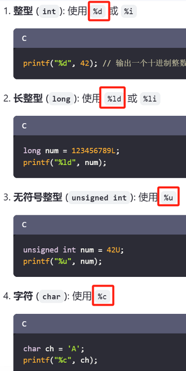
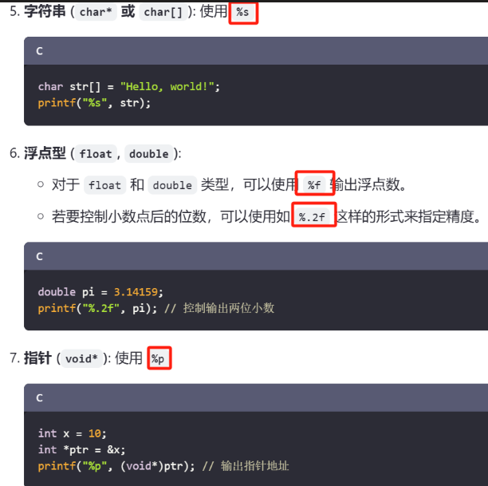
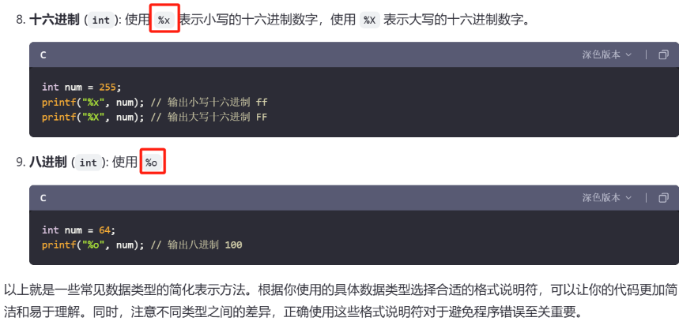
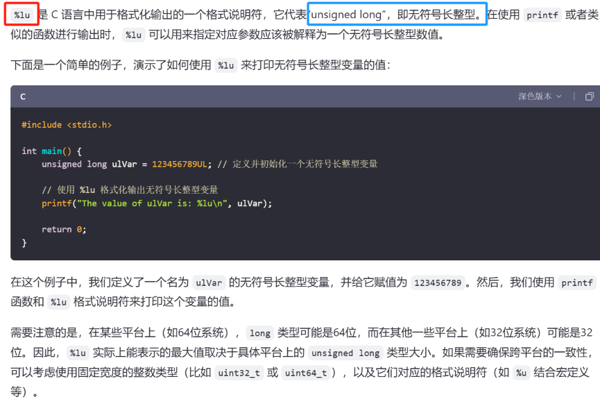
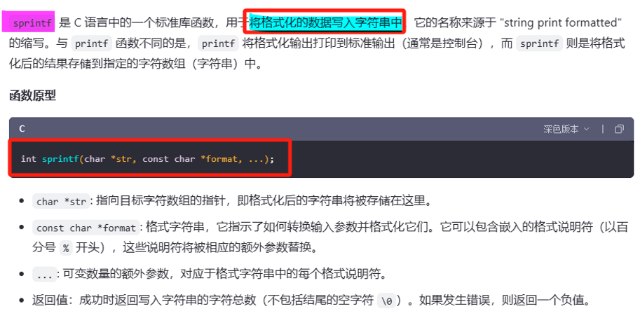
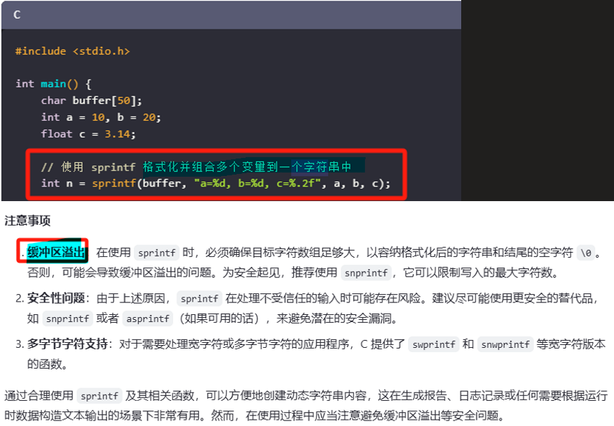
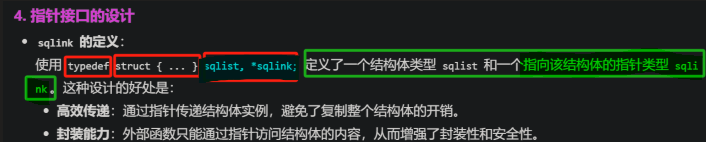
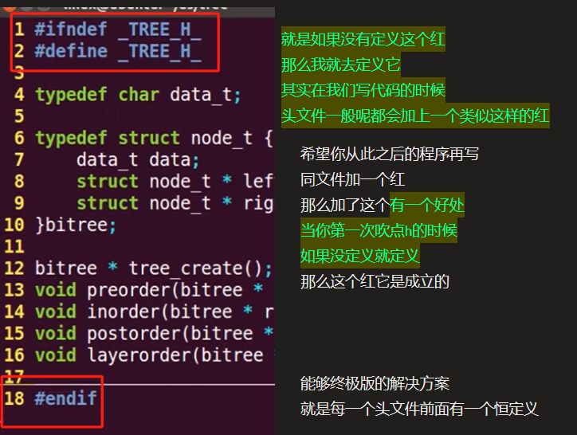

# extern 

<span style="background:#affad1">声明一个外部整型变量 riscv_is_pass，该变量是在另一个源文件中定义的。</span>
```
// 声明一个外部整型变量 riscv_is_pass，该变量是在另一个源文件中定义的。
// 使用 extern 关键字告诉编译器这个变量的存储位置在程序的其他地方，
// 这样可以在不包含其定义的情况下引用该变量。
extern int riscv_is_pass;
```


# printf参数（格式说明符）

- 1 %s后面跟的就是地址，如果这个地址是字符串的，那就显示字符串

[[嵌入式知识学习（通用扩展）/linux基础知识/assets/C语言扩展积累学习/file-20250810171433627.png|Open: Pasted image 20250708205943.png]]

[[嵌入式知识学习（通用扩展）/linux基础知识/assets/C语言扩展积累学习/file-20250810171433815.png|Open: Pasted image 20250708210004.png]]

[[嵌入式知识学习（通用扩展）/linux基础知识/assets/C语言扩展积累学习/file-20250810171433898.png|Open: Pasted image 20250708210019.png]]

[[嵌入式知识学习（通用扩展）/linux基础知识/assets/C语言扩展积累学习/file-20250810171433982.png|Open: Pasted image 20250708210035.png]]


## 使用位运算手动输出二进制
- 1 int   型变量
```c
void print_binary(int num) {
    int size = sizeof(num) * 8;
    for (int i = size - 1; i >= 0; i--) {
        printf("%d", (num >> i) & 1);
    }
    printf("\n");
}
```

- 1 char   型变量
```c
// 函数：输出字符的二进制表示
void print_binary_char(char c) {
    // 将字符转换为无符号类型，避免符号扩展问题
    unsigned char uc = (unsigned char)c;

    // 从最高位（第7位）到最低位（第0位）依次输出
    for (int i = 7; i >= 0; i--) {
        // 右移 i 位后与 1 按位与，判断该位是否为 1
        printf("%u", (uc >> i) & 1);
    }

    printf("\n");
}
```


# spintf函数
[[嵌入式知识学习（通用扩展）/linux基础知识/assets/C语言扩展积累学习/file-20250810171434063.png|Open: Pasted image 20250708150128.png]]

[[嵌入式知识学习（通用扩展）/linux基础知识/assets/C语言扩展积累学习/file-20250810171434157.png|Open: Pasted image 20250708150140.png]]



# typedef+结构体
[[嵌入式知识学习（通用扩展）/linux基础知识/assets/C语言扩展积累学习/file-20250810171434238.png|Open: Pasted image 20250708215942.png]]



# .h文件中预处理符号的作用（如果没定义就定义）
[[嵌入式知识学习（通用扩展）/linux基础知识/assets/C语言扩展积累学习/file-20250810171434321.png|Open: Pasted image 20250709200029.png]]



# 结构体指针L->last（箭头操作符）
[[嵌入式知识学习（通用扩展）/linux基础知识/assets/C语言扩展积累学习/file-20250810171434399.png|Open: Pasted image 20250709205330.png]]


# a=STR(h);
```c
#define STR(s) #s

char a;
a=STR(h);

```


```
main.c:75:6: warning: assignment to ‘char’ from ‘char *’ makes integer from pointer without a cast
```

> 这个警告的核心在于 **类型不匹配**：你试图将一个字符串（`char*` 类型）赋值给一个 `char` 类型的变量，导致指针被隐式转换为整数（即字符的 ASCII 值），这是不安全的操作。


# 判断大小时，sizeof(通用)与strlen有什么区别。

|**特性**|**`sizeof`**|**`strlen`**|
|---|---|---|
|**作用对象**|任意数据类型（如基本类型、数组、结构体、指针等）|仅用于以 `\0` 结尾的字符串（字符数组或字符指针）|
|**示例**|`sizeof(int)`、`sizeof(arr)`、`sizeof(struct S)`|`strlen("hello")`、`strlen(str)`|


# 多修饰符修饰变量
```c
extern u64 __cacheline_aligned_in_smp jiffies_64
```

> `__cacheline_aligned_in_smp`是gcc扩展语法
> 一个内核宏定义，用于解决 **伪共享（False Sharing）** 问题，确保变量在内存中按 **缓存行（Cache Line）对齐**。
> - 在多核（SMP）系统中，`__cacheline_aligned_in_smp` 会被展开为 `__cacheline_aligned`，即使用 `__attribute__((aligned(64)))`（假设缓存行大小为 64 字节）。
> - 在单核系统中，该宏为空，无需对齐。

# 动态分配内存

### 方案1：添加头文件声明（适用于用户空间程序）

如果是用户空间程序，添加stdlib.h头文件是最直接的解决方案：

```d
#include <stdlib.h>  // 提供动态内存管理函数声明

    //定义args*类型的结构体变量test
    struct args *test;
    test=(struct args *)malloc(sizeof(struct args));

free(test);

```

### 方案2：使用内核内存分配函数（适用于内核模块）

> ​**​在内核模块中，你不应该使用标准库的malloc函数​**​，而应该使用Linux内核提供的内存分配函数

```d
#include <linux/slab.h> // 包含内核内存分配函数

// 使用kmalloc分配内存
test = (struct args *)kmalloc(sizeof(struct args), GFP_KERNEL);

// 或者使用kzalloc，它会自动将分配的内存初始化为0
test = (struct args *)kzalloc(sizeof(struct args), GFP_KERNEL);
```

- 1 使用内核内存分配函数后，在不需要时要使用`kfree`释放内存：

```d
kfree(test); // 释放内存
```


# `~0`
```c
11111111 11111111 11111111 11111111
```
> 在计算机中，负数以 **补码** 形式存储。全 1 的二进制补码表示 `-1`，因此 `~0` 的**结果为 `-1`**


# 回调函数
> （Callback Function）是一种编程概念，指的是将一个**函数作为参数传递给另一个函数**，并在特定条件满足或某个操作完成后**被调用执行**。它常用于处理异步操作、事件响应或需要动态扩展功能的场景。

# for_each_child_of_node(root, child) { ... }
- - `for_each_child_of_node` 是一个宏，封装了设备树节点的遍历逻辑，通常展开为：
```c
struct device_node *child; 
for (child = of_get_next_child(root, NULL); 
	child != NULL; 
	child = of_get_next_child(root, child)) { ... }
```

# 为什么用 `length – 1` 来计算结束地址？

> 在设备树（Device Tree）的 `ranges` 属性中，`length` 表示映射区间的大小。为了确定映射区域的【结束地址】，如下公式适用：

```c
结束地址 = 起始地址 + 长度 - 1
```

> 这是因为长度是以字节或地址单位计算所覆盖的【总数】，而地址范围是**包含起始和结束这两个端点**的。例如：

> - 假设 `length = 0x10000`，表示区间长度是 65536 字节（或者 65536 个地址单位）。
>     
> - 如果起始地址（child 或 parent）是 X，那么这个区间实际覆盖的地址是从 X 开始，一直到 `X + 0x10000 - 1` 结束。这就是为什么要用 `-1` 的原因。

## 举个简单类比说明：

如果你有一个区间从 0 开始，长度是 100：

- 实际的地址范围是从 0 到 `0 + 100 - 1 = 99`，一共包含 100 个地址（从 0 到 99）


# gcc编译链接自做的静态库

## 使用GCC编译源文件为对象文件（`.o`），但不进行链接
```c
gcc -c math_ops.c -o math_ops.o 
gcc -c string_ops.c -o string_ops.o
```


## 使用`ar`工具将多个对象文件打包成一个静态库（`.a`）。
```c
ar rcs libsqlistlib.a sqlist.o 
```
> `rcs`参数告诉`ar`工具执行以下操作：`r`替换或插入成员，`c`创建归档文件，`s`创建索引以加快链接速度。

## 编译并链接主程序和静态库：
```c
gcc test.c -L./ -lsqlistlib -o test
```

## 使用 `-I` 选项 - 添加包含头文件的目录到编译器的搜索路径
```c
gcc -I./include -o output src/main.c
```


# container_of宏
```d
#define container_of(ptr, type, member) ({ \ const typeof( ((type *)0)->member ) *__mptr = (ptr); \ (type *)( (char *)__mptr - offsetof(type,member) );})
```

### 参数解释

> - `ptr`: 指向结构体中**某个成员的指针**。
> - `type`: 包含该成员的**完整结构体类型**。
> - `member`: 结构体内的**成员名**，即`ptr`指向的那个成员。


