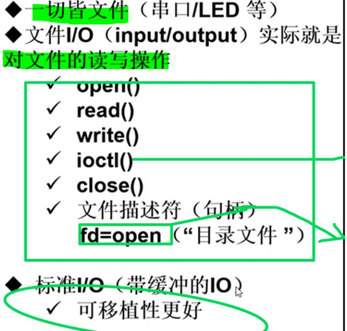
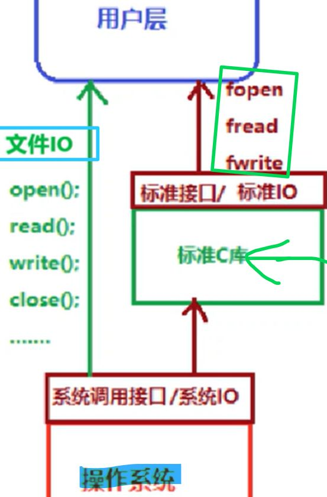
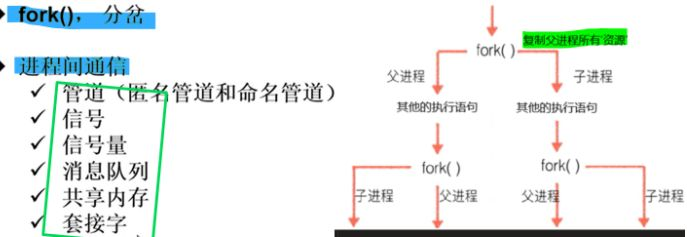
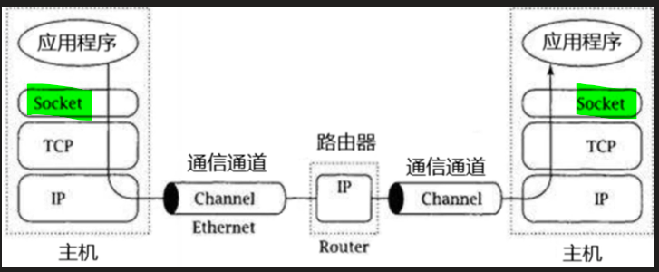
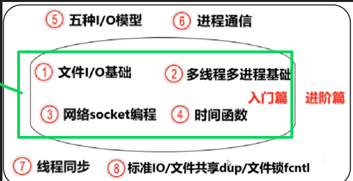

# 一切皆文件
[[嵌入式知识学习（通用扩展）/linux基础知识/Linux系统编程篇/assets/大纲框架：/bd68fd2f33eefb1e291b6d8893a32ee8_MD5.jpeg|Open: file-20250912145305793.png]]

# 系统调用
[[嵌入式知识学习（通用扩展）/linux基础知识/Linux系统编程篇/assets/大纲框架：/922b2859ffb4d7ad34ea660a870d87f3_MD5.jpeg|Open: file-20250912145348246.png]]

# Linux多进程
[[嵌入式知识学习（通用扩展）/linux基础知识/Linux系统编程篇/assets/大纲框架：/560f12fbf2c8ec3dce8e53ab5a301c51_MD5.jpeg|Open: file-20250912145411458.png]]

# 网络通信(socket编程)

# Linux应用编程框架

# 

# 
