# 备注(声明)：


# 一、Linux基础知识

## Ubuntu系统介绍
### 1 、打开终端
- 1 Ctrl加alt加t

### 2 、Ubuntu的组成
[[嵌入式知识学习（通用扩展）/linux基础知识/assets/（废弃）Linux入门篇（ubuntu基础知识）/9847b906df2e895672b9fae352f86b83_MD5.jpeg|Open: 1757569003902.jpg]]
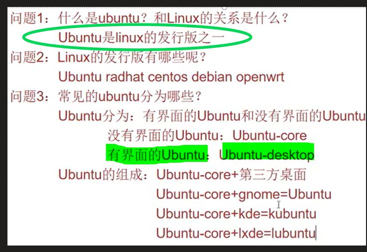

- 1 无界面的ubuntu + 第三方界面
### 3 、


## vim编辑器的使用
### 1 、vim编辑器简介
[[嵌入式知识学习（通用扩展）/linux基础知识/assets/（废弃）Linux入门篇（ubuntu基础知识）/12e9e2af1dddc389371926b017215497_MD5.jpeg|Open: 1757569038961.jpg]]
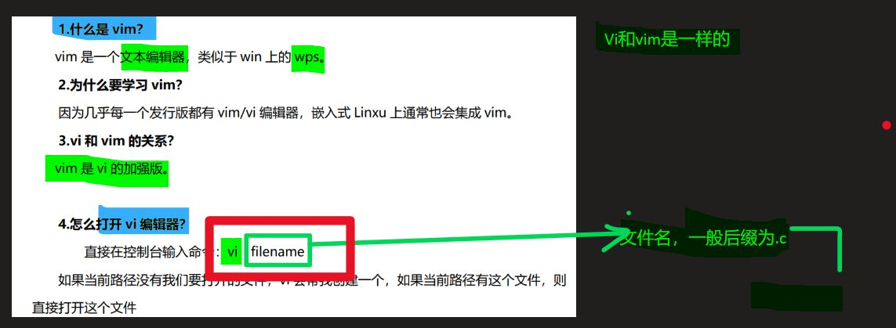

- 1 vim是vi的加强版

### 2 、打开文件

- 1 vi xxx

### 3 、一般模式（阅读模式）（Esc）

- 1 一般模式下移动光标和使用快捷键


### 4 、编辑模式（I）

- 1 Backspace删除前面的字母
- 1 delete删除后面的字母

- 1 编辑模式下编辑文本
### 5、命令行模式（：）

- 1 set number  显示行号
#### vim编辑器快速定位

- 1 gg                 将光标定位到第一行
- 1 G                   将光标定位到最后一行
- 1 ngg                将光标定位到第n行


####  dd 删除命令。
[[嵌入式知识学习（通用扩展）/linux基础知识/assets/（废弃）Linux入门篇（ubuntu基础知识）/543b53d96c1dd5e2a75997105d01e4e6_MD5.jpeg|Open: 1757569431292.jpg]]
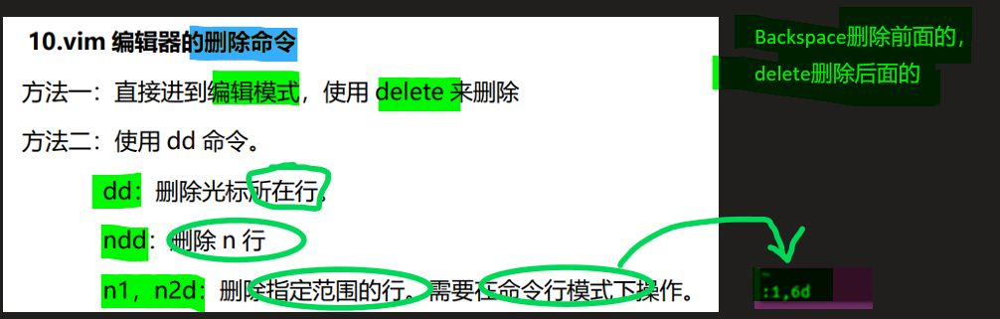


### 6、vim 编辑器的复制
[[嵌入式知识学习（通用扩展）/linux基础知识/assets/（废弃）Linux入门篇（ubuntu基础知识）/aadd5737032212025e8f01ab50c58457_MD5.jpeg|Open: 1757569319498.jpg]]
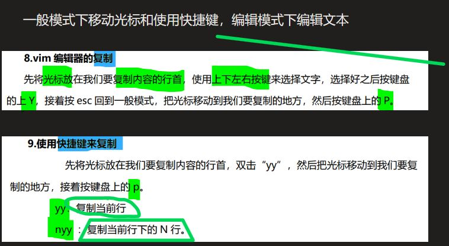


### 7、vim 的查找（?）（/）
[[嵌入式知识学习（通用扩展）/linux基础知识/assets/（废弃）Linux入门篇（ubuntu基础知识）/18b0c39a0a7322a7e1438fd2526eaad4_MD5.jpeg|Open: 1757569546370.jpg]]
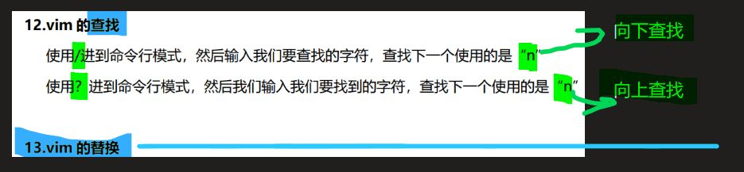

- 1 ?     向上查找
- 1 /      向下查找
### 8、vim 的替换
[[嵌入式知识学习（通用扩展）/linux基础知识/assets/（废弃）Linux入门篇（ubuntu基础知识）/e0a5ec25c1d4e4ec46971f180af04794_MD5.jpeg|Open: file-20250911134717422.png]]
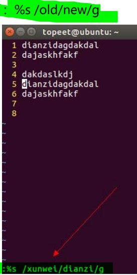

- 1 %s /old/new/g

### 9、vim 的保存

- 1 q！ 强行退出，不保存
- 1 wq    保存退出
- 1 q      退出没有编辑过的文本

### 10、vim 的文件对比
[[嵌入式知识学习（通用扩展）/linux基础知识/assets/（废弃）Linux入门篇（ubuntu基础知识）/bb3a7cdb087c37f83ad2e09664f35395_MD5.jpeg|Open: 1757569666863.jpg]]


- 1 vimdiff file1 file2 file3
### 11、


## Linux相对路径和绝对路径
### 1 、绝对路径 - 根目录开始


### 2 、相对路径 - 当前所在位置为基准的路径


- 1 ./
### 3 、


## Linux家目录和根目录概念
### 1 、根目录（/）


### 2 、家目录（~）

- 1 cd ~
### 3 、


## Linux帮助手册讲解
### 1 、打开命令
- 1 man 1 ls

- 1 man -f cd      查看命令在第几页
[[嵌入式知识学习（通用扩展）/linux基础知识/assets/（废弃）Linux入门篇（ubuntu基础知识）/7878442ed9187ccf5c9c60d3a6ff7e54_MD5.jpeg|Open: 1757569820042.jpg]]
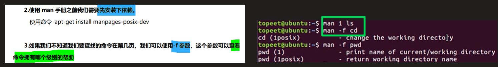

- 1 按q退出手册
### 2 、man手册九页内容讲解
[[嵌入式知识学习（通用扩展）/linux基础知识/assets/（废弃）Linux入门篇（ubuntu基础知识）/f20b17b980ad2315306bb10c862e926f_MD5.jpeg|Open: 1757569903176.jpg]]
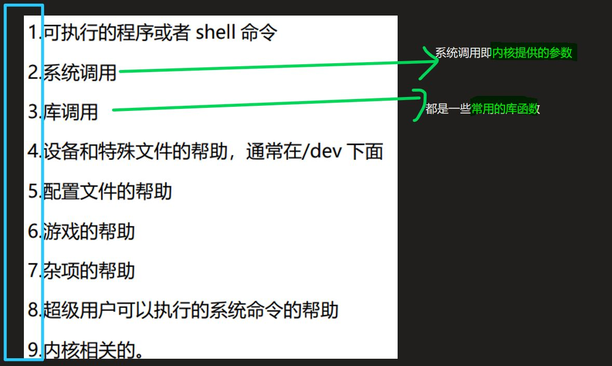

### 3 、


## Linux权限管理
### 1 、ubuntu文件权限讲解
[[嵌入式知识学习（通用扩展）/linux基础知识/assets/（废弃）Linux入门篇（ubuntu基础知识）/2c52255998c161dc92acb60df45a612a_MD5.jpeg|Open: 1757569940419.jpg]]
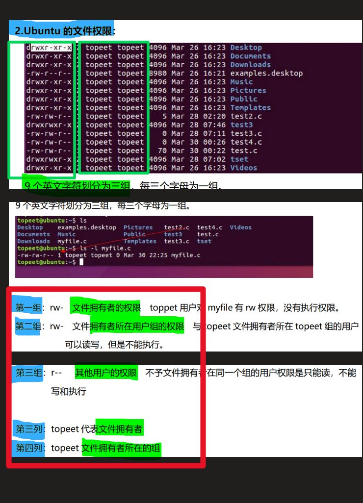

### 2 、ubuntu三种用户权限
[[嵌入式知识学习（通用扩展）/linux基础知识/assets/（废弃）Linux入门篇（ubuntu基础知识）/911f2712d9870883188274783778cf5c_MD5.jpeg|Open: 1757570046658.jpg]]
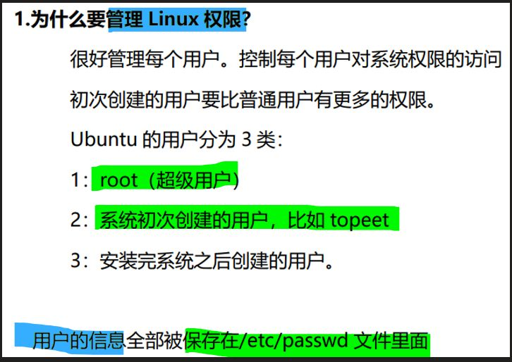

- 1 用户的信息全部被保存在/etc/passwd 文件里面
### 3 、二进制表示文件权限
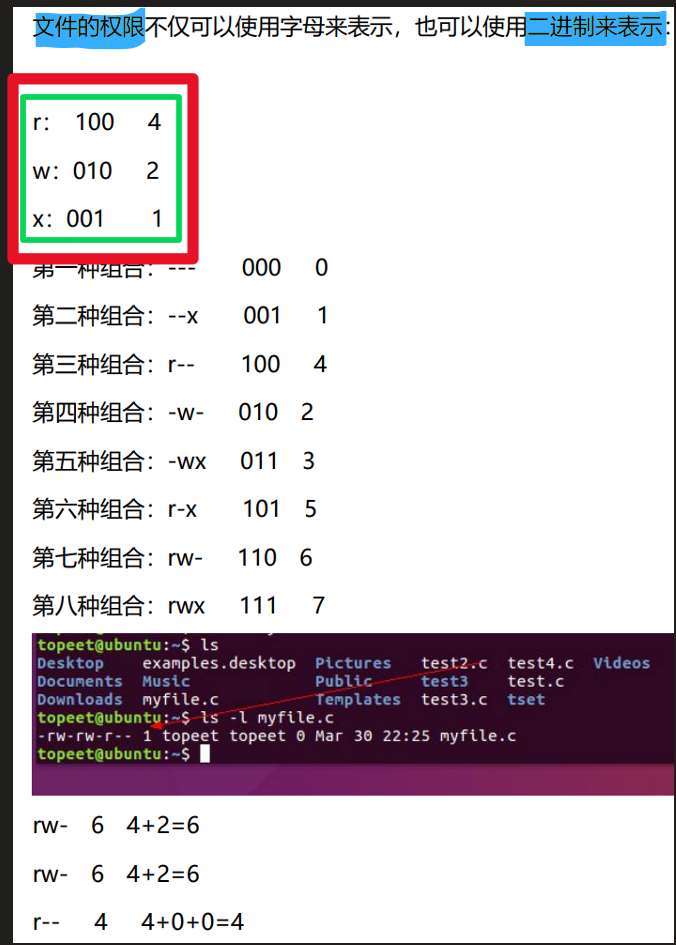

- 1 7  rwx
- 1 6  rw-
### 4 、


## Linux连接档概念（软链接和硬链接）
- 1 硬链接就是不想重复占用硬盘资源，给同一个文件开了一扇门，软链接就是一个独立的文件，它主要告诉你它继承的是哪个文件而已

### 1 、inode号（索引节点）（唯一）
[[嵌入式知识学习（通用扩展）/linux基础知识/assets/（废弃）Linux入门篇（ubuntu基础知识）/7baa21f98558864169b55915a0bd94d0_MD5.jpeg|Open: 1757571526391.jpg]]
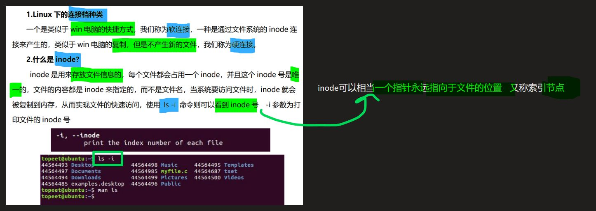

- 1 相当一个指针永远指向于文件的位置
- 1 存放文件信息        ls -li 可查看

### 2 、硬链接（inode号一样）
[[嵌入式知识学习（通用扩展）/linux基础知识/assets/（废弃）Linux入门篇（ubuntu基础知识）/d1ba92a568ff379bcb93d60825bdd817_MD5.jpeg|Open: 1757571659533.jpg]]
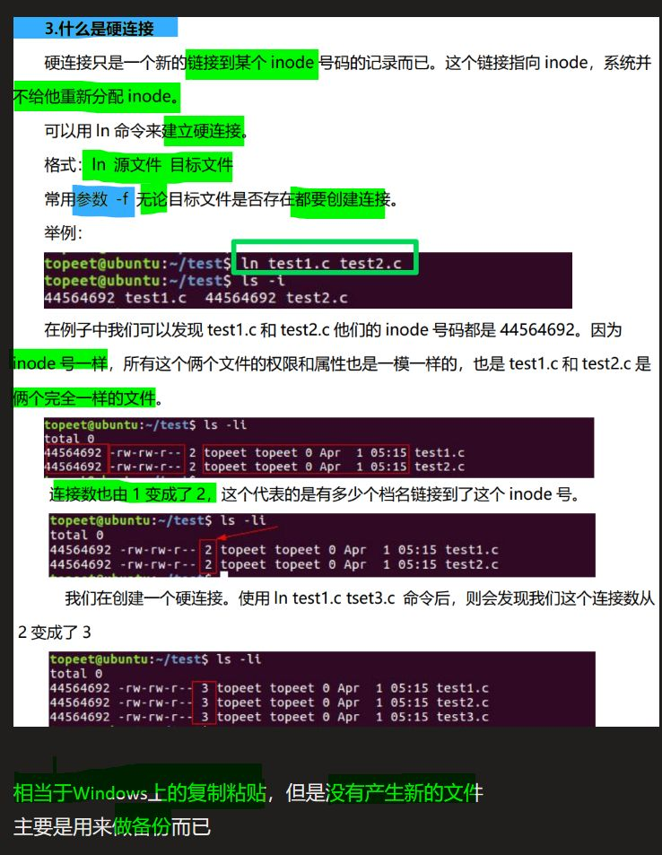

>  **In 源文件 目标文件**       -f  无论目标文件是否存在都要创建连接。
> 
>  **inode号一样，一样的文件，会同时被修改**
>  链接数--->inode号相同文件数
> 
>  相当于Windows上的复制粘贴，但是没有产生新的文件，主要是用来做备份而已。

#### 优点
[[嵌入式知识学习（通用扩展）/linux基础知识/assets/（废弃）Linux入门篇（ubuntu基础知识）/ceb6610818cbdd4fdf00e1cdd9f3e849_MD5.jpeg|Open: 1757571811607.jpg]]
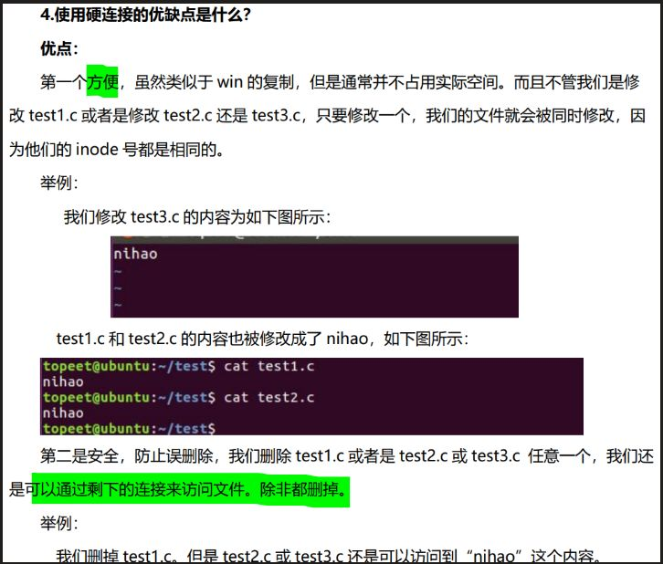

#### 缺点
[[嵌入式知识学习（通用扩展）/linux基础知识/assets/（废弃）Linux入门篇（ubuntu基础知识）/83e6e435f84035e9ce78cd286066875b_MD5.jpeg|Open: 1757571830478.jpg]]
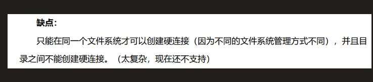

### 3 、软链接 （win上的快截方式）
[[嵌入式知识学习（通用扩展）/linux基础知识/assets/（废弃）Linux入门篇（ubuntu基础知识）/4cef3c6818c45b674c3707dba6cfe104_MD5.jpeg|Open: 1757572107349.jpg]]
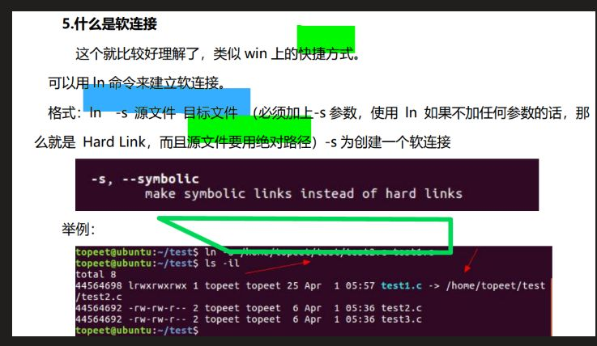

>  **In -s 源文件(绝对路经) 目标文件**
>  **inode号不一样，独立的文件，文件都是保持同步变化的**
> 
>  一旦以同样文件名创建了源文件，链接将继续指向该文件的新数据

#### 删除软链接
[[嵌入式知识学习（通用扩展）/linux基础知识/assets/（废弃）Linux入门篇（ubuntu基础知识）/f8ccf156a56fc445c1c9d677dbe3d07e_MD5.jpeg|Open: file-20250911142930698.png]]
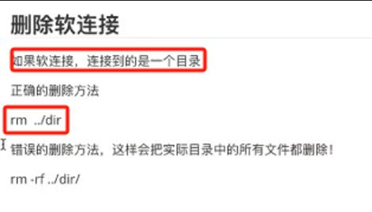

- 1 rm ./dir      正确删除软链接目录，不会删除实际目录 

### 4 、ubuntu中文件颜色的含义

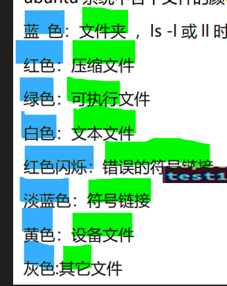

### 5、


## Linux目录结构讲解
### 1 、Linux根目录下各个文件存放内容的规定
[[嵌入式知识学习（通用扩展）/linux基础知识/assets/（废弃）Linux入门篇（ubuntu基础知识）/32dcafd1d711eb7cc3381d82df3f1f85_MD5.jpeg|Open: 1757572209970.jpg]]
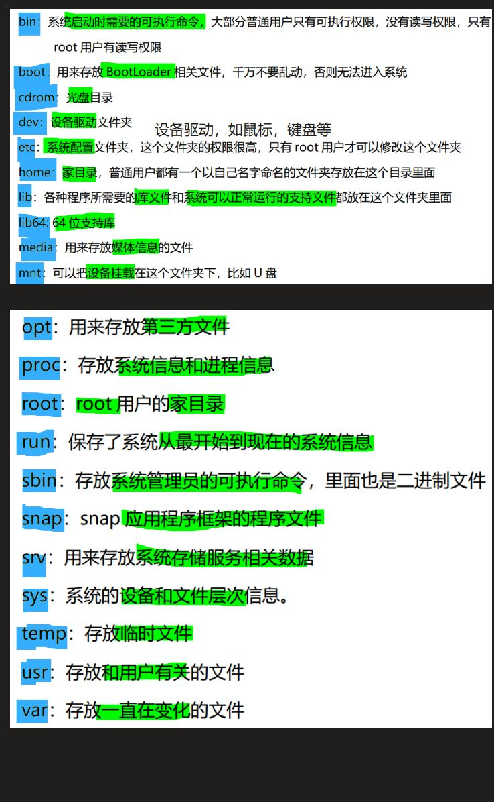

### 2 、


## Linux文件系统概念
### 1 、常见 Linux文件系统的格式都有哪些?
- 1 ext3，ext4，proc文件系统，sysfs 文件系统.

> [!note] Linux底层文件系统讲解
> Ext3（第三代扩展文件系统）：这是一个日志式文件系统，是Ext2的后继者。它为数据恢复提供了更好的可靠性，并且通过日志功能减少了意外断电或系统崩溃后的数据损坏风险。虽然现在已经被Ext4取代，但在一些旧的系统上仍然可以看到它的使用。
> 
> Ext4（第四代扩展文件系统）：这是Ext3的改进版本，提供了更高效的存储管理、更快的速度、更高的文件大小和分区容量限制（最大文件大小为16TB，最大卷大小为1EB）。Ext4是现代Ubuntu安装的默认文件系统，用于用户数据和大多数系统文件的存储。
> proc 文件系统（/proc）：这是一个虚拟文件系统，主要用于内核与进程之间的通信。它并不存储在硬盘上，而是存在于内存中。/proc 提供了一个接口，让用户可以查看当前系统运行的状态信息，包括进程列表、CPU负载、内存使用情况等。
> 
> sysfs 文件系统（/sys）：类似于/proc，/sys也是一个虚拟文件系统，但它主要用于提供对设备和驱动程序层次结构的访问。它允许用户空间程序获取设备信息并控制硬件设备，同时为内核开发者提供了一种组织和展示内核对象的方式。


### 2 、Ubuntu文件系统与 Linux底层文件系统关系

> [!note] ubuntu系统
> Ubuntu（或更广泛地说，Linux系统）支持多种文件系统类型，包括但不限于Ext3、Ext4、proc和sysfs。这些文件系统各自承担不同的角色：
> 
> 当提到“Ubuntu文件系统”时，我们<span style="background:#affad1">通常指的是整个系统的文件组织方式以及所使用的不同类型的文件系统。</span>这包括用于数据持久化存储的Ext3、Ext4等文件系统，也包括像proc和sysfs这样的虚拟文件系统，<span style="background:#affad1">它们共同构成了Ubuntu操作系统的基础架构</span>。换句话说，Ext3、Ext4、proc文件系统和sysfs文件系统都是Ubuntu支持的文件系统的一部分，各自服务于不同的目的。
> 
> 
> 


### 3 、


## Linux第一个程序HelloWorld
### 1 、gcc编译器
[[嵌入式知识学习（通用扩展）/linux基础知识/assets/（废弃）Linux入门篇（ubuntu基础知识）/73f2c7d7540e2ec22fb322dd8d69c747_MD5.jpeg|Open: 1757572445205.jpg]]
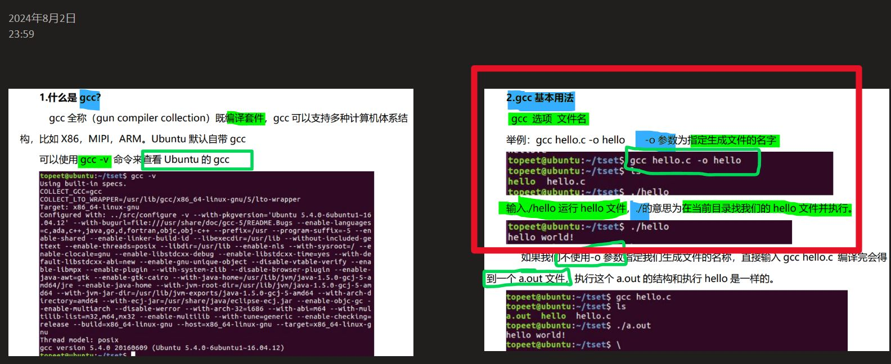


### 2 、动态编译（生成的程序需要依赖库）
[[嵌入式知识学习（通用扩展）/linux基础知识/assets/（废弃）Linux入门篇（ubuntu基础知识）/e99dd40fa1c9430e5d01a96ad03d5be9_MD5.jpeg|Open: 1757572479307.jpg]]
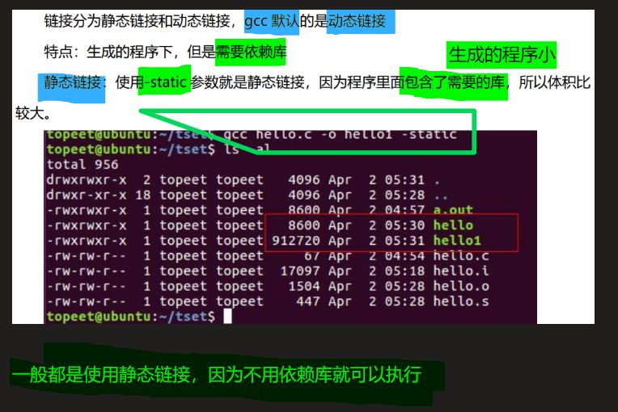

- 1 gcc默认是动态编译
- 1 使用-static参数就是静态链接，因为程序里面包含了需要的库，文件较大

## Linux编写第一个自己的命令

### 1 、定义一个自己的命令
- 1 把要执行的程序写到环境变量当中，就可以当做命令使用。

## samba的安装和使用
### 1 、pdf笔记
```c
path = /home/samba #共享的 samba 目录
```

.pdf)


### 2 、b站视频
[samba安装和使用_哔哩哔哩_bilibili](https://www.bilibili.com/video/BV1M7411m7wT?p=24&vd_source=83485b71343f442522d28357f4bb93eb)

### 3 、


## source insight的安装和使用
### 1 、source insight的安装和使用
[source insight的安装和使用](onenote:https://d.docs.live.net/52d4b76bb0ffcf51/Documents/\(RK3568\)Linux驱动开发/Linux入门篇.one#source%20insight的安装和使用&section-id={A6E83B73-B662-46C8-97A8-EEA249D06C37}&page-id={BCAD933E-BC32-4A42-8CEB-DAA2C836D974}&end)  ([Web 视图](https://onedrive.live.com/view.aspx?resid=52D4B76BB0FFCF51%21se8c325913f784bf694d429e5ee2ab2be&id=documents&wd=target%28Linux%E5%85%A5%E9%97%A8%E7%AF%87.one%7CA6E83B73-B662-46C8-97A8-EEA249D06C37%2Fsource%20insight%E7%9A%84%E5%AE%89%E8%A3%85%E5%92%8C%E4%BD%BF%E7%94%A8%7CBCAD933E-BC32-4A42-8CEB-DAA2C836D974%2F%29&wdpartid=%7b66F44A39-1899-42D0-A4C0-9FC9A7ADC317%7d%7b1%7d&wdsectionfileid=52D4B76BB0FFCF51!sa9a91d2a66d74178a12e2e5ebf58d0b7))


# 三、手册指导（ubuntu(虚拟机)使用手册）

## 1、安装虚拟机 VMware 软件
> [!PDF|red] [[芯片开发学习/RK3568（linux学习）/linux开发资料库/rk3568迅为开发pdf/16.开发板学习教程/【北京迅为】itop-3568ubuntu使用手册.pdf#page=11&selection=20,0,26,2&color=red|【北京迅为】itop-3568ubuntu使用手册, p.11]]
> > 第一章安装虚拟机 VMware 软件
> 
> 
### 


### 


### 


## 2、获取并安装 Ubuntu 操作系统
> [!PDF|red] [[芯片开发学习/RK3568（linux学习）/linux开发资料库/rk3568迅为开发pdf/16.开发板学习教程/【北京迅为】itop-3568ubuntu使用手册.pdf#page=17&selection=20,0,26,4&color=red|【北京迅为】itop-3568ubuntu使用手册, p.17]]
> > 第二章获取并安装 Ubuntu 操作系统
> 
> 

### 


### 


### 


## 3、Ubuntu 系统介绍
> [!PDF|red] [[芯片开发学习/RK3568（linux学习）/linux开发资料库/rk3568迅为开发pdf/16.开发板学习教程/【北京迅为】itop-3568ubuntu使用手册.pdf#page=26&selection=20,0,24,4&color=red|【北京迅为】itop-3568ubuntu使用手册, p.26]]
> > 第三章 Ubuntu 系统介绍
> 
> 
### 


### 


### 


## 4、Ubuntu 启用 root 用户
> [!PDF|red] [[芯片开发学习/RK3568（linux学习）/linux开发资料库/rk3568迅为开发pdf/16.开发板学习教程/【北京迅为】itop-3568ubuntu使用手册.pdf#page=32&selection=20,0,28,2&color=red|【北京迅为】itop-3568ubuntu使用手册, p.32]]
> > 第四章 Ubuntu 启用 root 用户
> 
> 
### 


### 


### 


## 5、Ubuntu 使用 apt-get 下载
> [!PDF|red] [[芯片开发学习/RK3568（linux学习）/linux开发资料库/rk3568迅为开发pdf/16.开发板学习教程/【北京迅为】itop-3568ubuntu使用手册.pdf#page=34&selection=20,0,28,2&color=red|【北京迅为】itop-3568ubuntu使用手册, p.34]]
> > 第五章 Ubuntu 使用 apt-get 下载
> 
> 
### 


### 


### 

## 6、 Vim 编辑器的使用
> [!PDF|red] [[芯片开发学习/RK3568（linux学习）/linux开发资料库/rk3568迅为开发pdf/16.开发板学习教程/【北京迅为】itop-3568ubuntu使用手册.pdf#page=41&selection=20,0,24,6&color=red|【北京迅为】itop-3568ubuntu使用手册, p.41]]
> > 第六章 Vim 编辑器的使用
> 
> 

### 


### 


### 

## 7、常用命令第一部分
> [!PDF|red] [[芯片开发学习/RK3568（linux学习）/linux开发资料库/rk3568迅为开发pdf/16.开发板学习教程/【北京迅为】itop-3568ubuntu使用手册.pdf#page=52&selection=20,0,22,8&color=red|【北京迅为】itop-3568ubuntu使用手册, p.52]]
> > 第七章常用命令第一部分
> 
> 

### 


### 


### 


## 8、相对路径和绝对路径
> [!PDF|red] [[芯片开发学习/RK3568（linux学习）/linux开发资料库/rk3568迅为开发pdf/16.开发板学习教程/【北京迅为】itop-3568ubuntu使用手册.pdf#page=59&selection=20,0,22,9&color=red|【北京迅为】itop-3568ubuntu使用手册, p.59]]
> > 第八章相对路径和绝对路径
> 
> 

### 


### 


### 


## 9、家目录和根目录概念
> [!PDF|red] [[芯片开发学习/RK3568（linux学习）/linux开发资料库/rk3568迅为开发pdf/16.开发板学习教程/【北京迅为】itop-3568ubuntu使用手册.pdf#page=60&selection=0,10,22,9&color=red|【北京迅为】itop-3568ubuntu使用手册, p.60]]
> > 北京迅为电子有限公司 iTOP-3568 开发板 Ubuntu 使用手册日期：2022-1-17 www.topeetboard.com60 第九章家目录和根目录概念
> 
> 

### 


### 


### 


## 10、常用命令第二部分
> [!PDF|red] [[芯片开发学习/RK3568（linux学习）/linux开发资料库/rk3568迅为开发pdf/16.开发板学习教程/【北京迅为】itop-3568ubuntu使用手册.pdf#page=62&selection=20,0,22,8&color=red|【北京迅为】itop-3568ubuntu使用手册, p.62]]
> > 第十章常用命令第二部分
> 
> 

### 


### 


### 


## 11、帮助手册讲解
> [!PDF|red] [[芯片开发学习/RK3568（linux学习）/linux开发资料库/rk3568迅为开发pdf/16.开发板学习教程/【北京迅为】itop-3568ubuntu使用手册.pdf#page=75&selection=20,0,22,6&color=red|【北京迅为】itop-3568ubuntu使用手册, p.75]]
> > 第十一章帮助手册讲解
> 
> 

### 


### 


### 


## 12、权限管理
> [!PDF|red] [[芯片开发学习/RK3568（linux学习）/linux开发资料库/rk3568迅为开发pdf/16.开发板学习教程/【北京迅为】itop-3568ubuntu使用手册.pdf#page=77&selection=20,0,22,4&color=red|【北京迅为】itop-3568ubuntu使用手册, p.77]]
> > 第十二章权限管理
> 
> 

### 


### 


### 


## 13、连接档概念（软、硬链接）
> [!PDF|red] [[芯片开发学习/RK3568（linux学习）/linux开发资料库/rk3568迅为开发pdf/16.开发板学习教程/【北京迅为】itop-3568ubuntu使用手册.pdf#page=80&selection=20,0,22,5&color=red|【北京迅为】itop-3568ubuntu使用手册, p.80]]
> > 第十三章连接档概念
> 
> 

### 


### 


### 


## 14、linux目录结构讲解
> [!PDF|red] [[芯片开发学习/RK3568（linux学习）/linux开发资料库/rk3568迅为开发pdf/16.开发板学习教程/【北京迅为】itop-3568ubuntu使用手册.pdf#page=84&selection=20,0,22,6&color=red|【北京迅为】itop-3568ubuntu使用手册, p.84]]
> > 第十四章目录结构讲解
> 
> 

### 


### 


### 


## 15、文件系统的讲解

> [!PDF|red] [[芯片开发学习/RK3568（linux学习）/linux开发资料库/rk3568迅为开发pdf/16.开发板学习教程/【北京迅为】itop-3568ubuntu使用手册.pdf#page=87&selection=20,0,22,7&color=red|【北京迅为】itop-3568ubuntu使用手册, p.87]]
> > 第十五章文件系统的讲解
> 
> 

### 


### 


### 


## 16、第一个程序 HelloWorld
> [!PDF|red] [[芯片开发学习/RK3568（linux学习）/linux开发资料库/rk3568迅为开发pdf/16.开发板学习教程/【北京迅为】itop-3568ubuntu使用手册.pdf#page=89&selection=20,0,24,10&color=red|【北京迅为】itop-3568ubuntu使用手册, p.89]]
> > 第十六章第一个程序 HelloWorld
> 
> 

### 


### 


### 


## 17、环境变量讲解
> [!PDF|red] [[芯片开发学习/RK3568（linux学习）/linux开发资料库/rk3568迅为开发pdf/16.开发板学习教程/【北京迅为】itop-3568ubuntu使用手册.pdf#page=92&selection=20,0,22,6&color=red|【北京迅为】itop-3568ubuntu使用手册, p.92]]
> > 第十七章环境变量讲解
> 
> 

### 


### 


### 


## 18、第一个命令的编写
> [!PDF|red] [[芯片开发学习/RK3568（linux学习）/linux开发资料库/rk3568迅为开发pdf/16.开发板学习教程/【北京迅为】itop-3568ubuntu使用手册.pdf#page=94&selection=20,0,22,8&color=red|【北京迅为】itop-3568ubuntu使用手册, p.94]]
> > 第十八章第一个命令的编写
> 
> 
### 


### 


### 


## 19、make 工具和 makefile 文件
> [!PDF|red] [[芯片开发学习/RK3568（linux学习）/linux开发资料库/rk3568迅为开发pdf/16.开发板学习教程/【北京迅为】itop-3568ubuntu使用手册.pdf#page=97&selection=20,0,28,2&color=red|【北京迅为】itop-3568ubuntu使用手册, p.97]]
> > 第十九章 make 工具和 makefile 文件
> 
> 

### 


### 


### 


## 20、makefile 基本语法（上）
> [!PDF|red] [[芯片开发学习/RK3568（linux学习）/linux开发资料库/rk3568迅为开发pdf/16.开发板学习教程/【北京迅为】itop-3568ubuntu使用手册.pdf#page=100&selection=20,0,24,7&color=red|【北京迅为】itop-3568ubuntu使用手册, p.100]]
> > 第二十章 makefile 基本语法（上）
> 
> 

### 


### 


### 

## 21、makefile 基本语法（下）

> [!PDF|red] [[芯片开发学习/RK3568（linux学习）/linux开发资料库/rk3568迅为开发pdf/16.开发板学习教程/【北京迅为】itop-3568ubuntu使用手册.pdf#page=107&selection=20,0,24,7&color=red|【北京迅为】itop-3568ubuntu使用手册, p.107]]
> > 第二十一章 makefile 基本语法（下）
> 
> 

### 


### 


### 


# 四、

## 
### 1 、


### 2 、


### 3 、

### 4 、

### 5、


### 6、


### 7、


### 8、


## 
### 1 、


### 2 、


### 3 、

### 4 、
### 5、


### 6、


### 7、


### 8、


## 
### 1 、


### 2 、


### 3 、

### 4 、

### 5、


### 6、


### 7、


### 8、


# 五、

## 
### 1 、


### 2 、


### 3 、

### 4 、

### 5、


### 6、


### 7、


### 8、


## 
### 1 、


### 2 、


### 3 、

### 4 、
### 5、


### 6、


### 7、


### 8、


## 
### 1 、


### 2 、


### 3 、

### 4 、

### 5、


### 6、


### 7、


### 8、


