# 一、 Ubuntu 启用 root 用户

## 4.1 命令行的组成

在启用root用户之前，先来了解一下，ubuntu命令的组成。

打开ubuntu的终端，可以看到命令行是由topeet@ubuntu:  $\sim \Phi$  这几个字母组成，如下图所示：

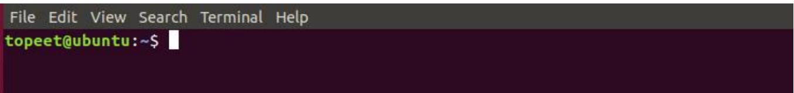

### 对应的说明框图如下：

<table><tr><td>组成</td><td>说明</td></tr><tr><td>topeet</td><td>当前操作用户</td></tr><tr><td>ubuntu</td><td>代表主机名</td></tr><tr><td>~</td><td>代表当前目录名</td></tr><tr><td>$</td><td>代表普通用户操作权限</td></tr><tr><td>#</td><td>root 用户权限</td></tr></table>

## 4.2 启用root用户的原因

4.2 启用 root 用户的原因身为嵌入式开发人员，使用 ubuntu 系统是来做嵌入式开发的，而不是 linux 运维，所以不需要对 root 权限非常敏感，系统的权限都需要为我们打开。在默认安装好的 ubuntu 系统中，root 用户是被禁用的，可以根据下一小节来启用 root 用户。

## 4.3 启用root用户步骤

首先在ubuntu的终端输入以下命令

- 1 sudo passwd

- 1 尝试用 `sudo -i` 或 `sudo su` 切换为 root


> 然后输入ubuntu的密码，**密码就是ubuntu的登录密码**，接着输入两次新的unix密码，如下图所示。

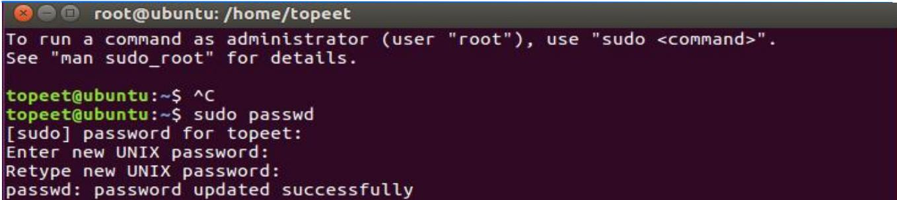

输入以下命令测试能否切换到root用户，输入刚刚设置的密码，可以看到现在的用户名就变成了root，root就已经启用成功了。

- 1 su root

root@ubuntu:/home/topeet#

## 4.4 退出root用户

在终端输入以下命令从root用户退出到topeet用户，如下图所示：

- 1 exit

这样就退回到了普通用户，如下图所示。

root@ubuntu:/home/topeet# exit exit topeet@ubuntu:\~\$

从普通用户再次切换到root用户，直接输入以下命令，然后直接输入密码即可。

su root

在切换到root用户后，操作用户已经从topeet变成了root，~也变成了/,并且  $\mathbb{S}$  变成了#，#代表的是超级用户操作权限，即使启用了root用户，也不要在root下乱删东西，可能会造成环境的损坏。

# 二、 Ubuntu 使用 apt-get 下载

本章来学习 ubuntu 中的 apt- get 命令，ubuntu 为什么而闻名？第一，ubuntu 有一个非常好的图形界面，第二就是 ubuntu 的 apt- get 功能强大。

什么是 apt- get 呢，在 windows 上安装软件，大家一定都非常的熟悉了，直接下载安装就可以了，在 ubuntu 中对于部分软件也可以这样做，如果说这个软件支持 linux 系统，可以通过浏览器，对该软件进行下载安装，但这种情况极其少见，基本都是通过 apt- get 命令来下载的，该命令可以实现软件的自动下载、安装以及配置。

## 5.1 联网测试

apt- get 命令它采用的是客户端和服务器的模式，ubuntu 系统作为客户端，需要下载软件的时候，客户端就会向服务器发出请求，所以说在使用 apt- get 之前，ubuntu 系统必须是可以联网的。

在左侧菜单栏打开火狐浏览器，测试浏览器能不能上网，如下图所示，成功的访问了迅为的官网，就说明 ubuntu 的网络是正常的，就可以继续进行下面的步骤了。

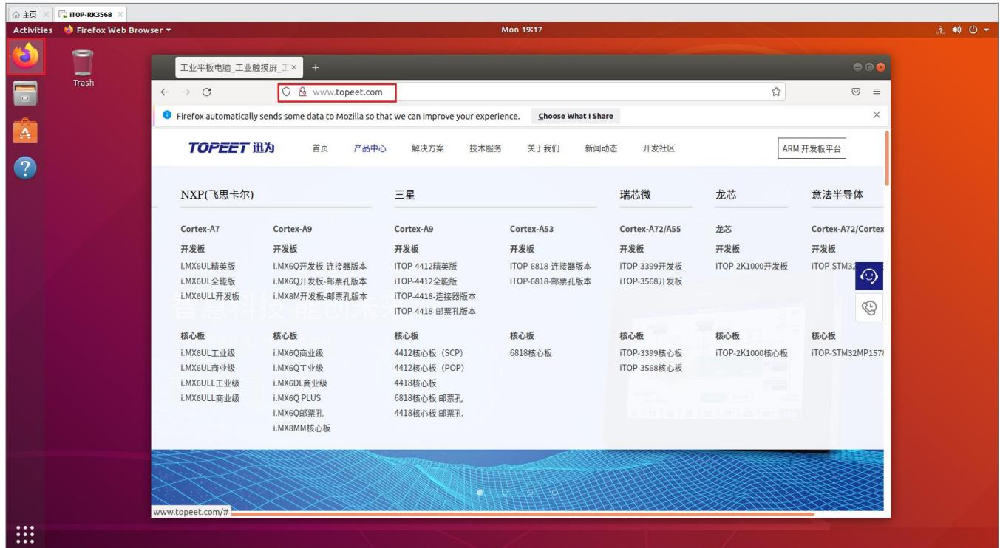

## 5.2设置下载源

5.2 设置下载源为了提高软件的下载速度，首先要设置一下下载源。点击 ubuntu 桌面左下角的九宫格进入应用菜单界面，如下图所示：


然后点击第二行 Software&Update 应用，进入该应用之后如下图所示：

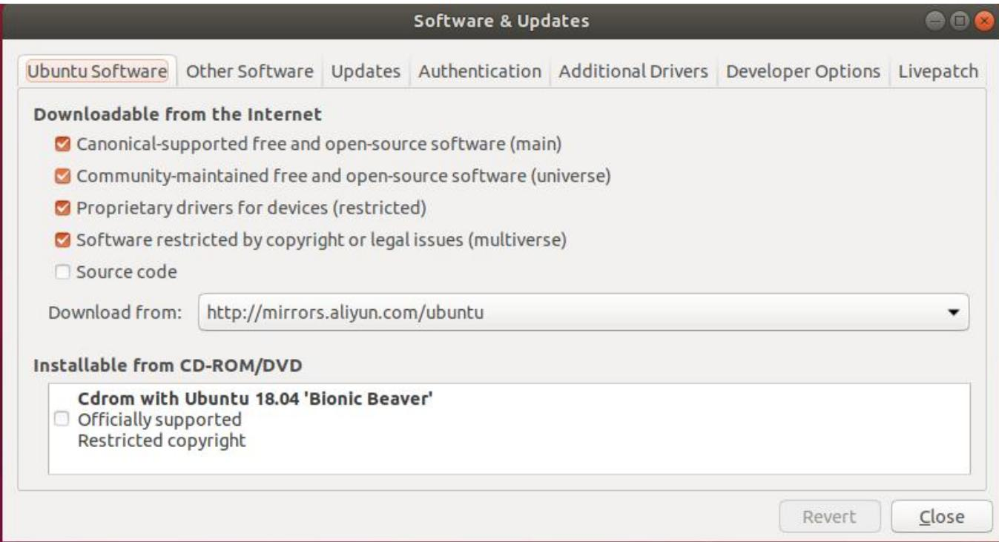

点击“Download from”软件软选择框选择 Other..，如下图所示：

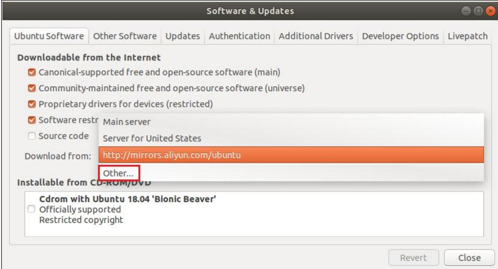

然后选择国家为 China，软件镜像源选择为阿里云，选中之后点击右下角的 Choose Server 如下图所示：

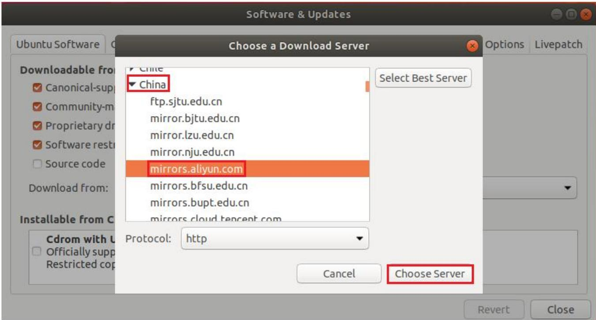

接下来输入虚拟机密码，至此。软件源就更换成功了，随后点击 Close 关闭该页面，会有弹出以下界面，提醒软件源信息已经更新，这里选择 Reload 如下图所示：

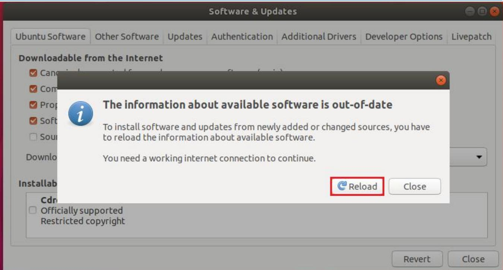

之后需要等待一些插件的更新，如下图所示：

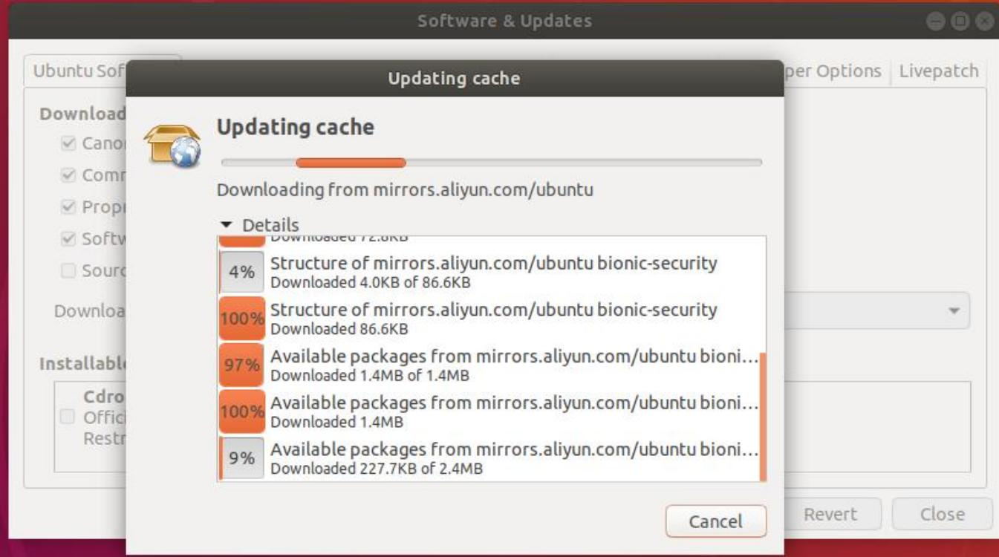

更新完成之后，会回到 ubuntu 桌面，至此就成功更换了 ubuntu 的软件源。

## 5.3 更新下载源

下载源设置好之后，需要对下载源进行更新，使用的命令为“apt- get update”。该命令会访问源列表中的网址，并将读取到的软件列表保存在本地。

打开控制台，然后切换到 root 用户，输入以下命令如下图所示

- 1 apt- get update

等待更新完成，更新一次之后，如果担心没有成功，可以重复更新一次，如下图所示：

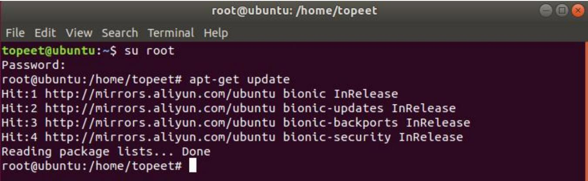

## 5.4 安装 vim 软件

更新完软件源之后，就可以进行软件的安装了，
### 安装命令格式如下图所示：

- 1 apt- get install package-name

### 安装 vim 编辑器软件

- 1  apt- get install vim

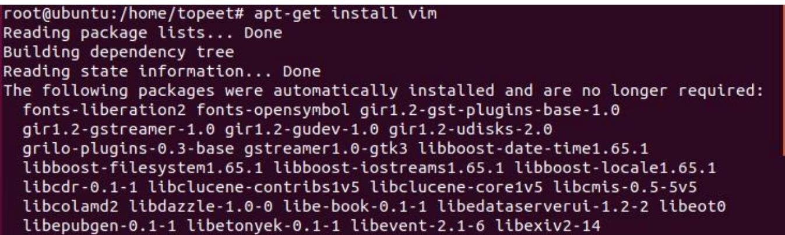

这里会提示要不要继续，输入 y 敲回车就可以继续进行了，如下图所示：

Do you want to continue? [Y/n] y  Get:1 http://mirrors.aliyun.com/ubuntu bionic- updates/main amd64 vim- tiny amd64 2:8.0.1453- 1ubuntu1.8 [476. k8]  Get:2 http://mirrors.aliyun.com/ubuntu bionic- updates/main amd64 vim- common all 2:8.0.1453- 1ubuntu1.8 [71.1 kB]  Get:3 http://mirrors.aliyun.com/ubuntu bionic- updates/main amd64 vim- runtime all 2:8.0.1453- 1ubuntu1.8 [5,435 kB]

等待安装完成即可，安装其他软件命令格式相同。

## 5.5 软件的更新（不要用）

使用 apt- get upgrade 命令可以进行软件的更新，该命令会与 apt- get update 下载的软件列表进行对比，如果发现当前安装的版本过低，就会提示更新。

输入以下命令来更新下vim，如下图所示

apt- get upgrade vim

root@ubuntu:/home/topeet# apt- get upgrade vim Reading package lists...Done Building dependency tree Reading state information...Done vim is already the newest version (2:8.0.1453- 1ubuntu1.8). Calculating upgrade...Done The following packages were automatically installed and are no longer required: fonts- liberation2 fonts- opensymbol gir1.2- gst- plugins- base- 1.0 gir1.2- gstreamer- 1.0 gir1.2- gudev- 1.0 gir1.2- udisks- 2.0 grilo- plugins- 0.3- base gstreamer1.0- gtk3 libboost- date- time1.65.1 libboost- filesystem1.65.1 libboost- iostreams1.65.1 libboost- locale1.65.1 libcdr- 0.1- 1 libclucene- contribsiv5 libclucene- coreiv5 libcmis- 0.5- 5v5 libcolamd2 libdazzle- 1.0- 0 libe- book- 0.1- 1 libedataserverui- 1.2- 2 libeot0

会提示要不要更新，输入y等待更新完成即可。

## 5.6软件的卸载

软件的卸载命令格式如下所示：

- 1 apt- get remove package-name

在这里以卸载vim软件为例，输入以下命令进行卸载，如下图所示：

- 2 apt- get remove vim

# 三、 常用命令第一部分

## 7.1 Is 命令：查看文件信息

### 隐藏文件的查看：ls - al

就会显示当前路径下所有文件和文件信息。在 ubuntu 中以“.”开头的全部是隐藏文件，例如 .bash_history 就是隐藏文件，如下图所示：

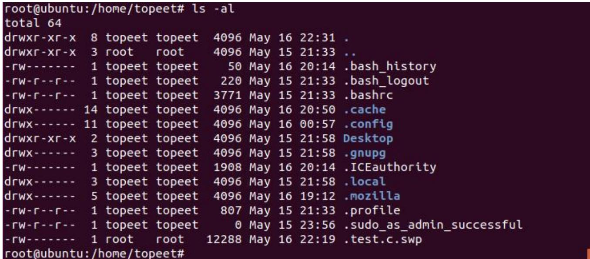

> 以上命令中有两个参数为“- a”和“- I”，对应的功能如下：**- a：显示所有的文件**，**- I：显示文件的详细信息**，如文件的形态、权限、所有者、大小信息等。下面对 ubuntu 文件信息内容进行讲解，从左往右依次分析。在 ubuntu 中，通过第一个参数来判断文件类型和文件权限，如下图所示：

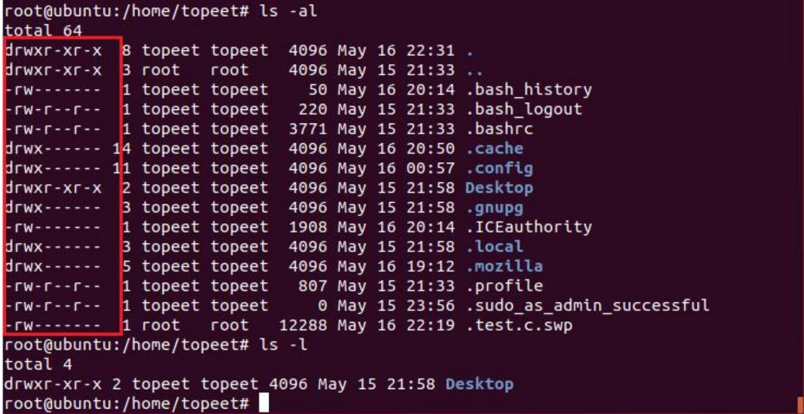

### 第一个参数对应的文件类型的图表：

<table><tr><td>参数名称</td><td>文件类型</td></tr><tr><td>d</td><td>目录文件</td></tr><tr><td>-</td><td>普通文件</td></tr><tr><td>p</td><td>管理文件</td></tr><tr><td>l</td><td>链接文件</td></tr><tr><td>b</td><td>块设备文件</td></tr><tr><td>c</td><td>字符设备文件</td></tr><tr><td>s</td><td>套接字文件</td></tr></table>

### rwxr 代表文件权限，对应的权限解释图表如下：

<table><tr><td>参数名称</td><td>文件类型</td></tr><tr><td>r</td><td>表示读权限</td></tr><tr><td>w</td><td>表示写权限</td></tr><tr><td>x</td><td>表示可执行权限</td></tr><tr><td>-</td><td>没有权限</td></tr></table>

### 第二列信息中，会出现8311等数字：

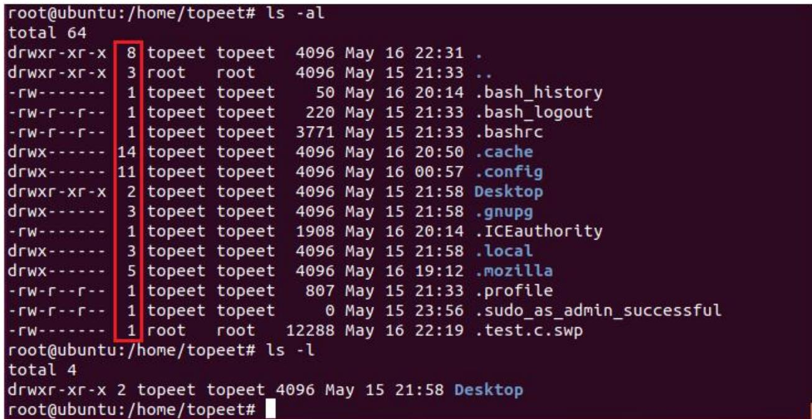


> 以 d 开头文件夹，所以说**该数字表示的是副目录下子文件夹的个数**，不包括文件。

### 第一个 topeet 指的是用户名，第二个 topeet 为组名：

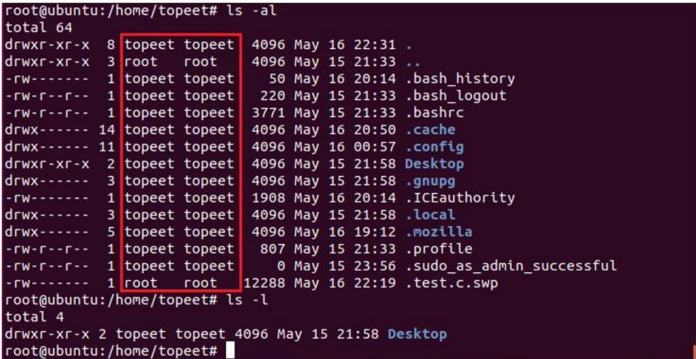

### 第四列的4096表示的是文件大小
- 2 单位是以字节为单位的
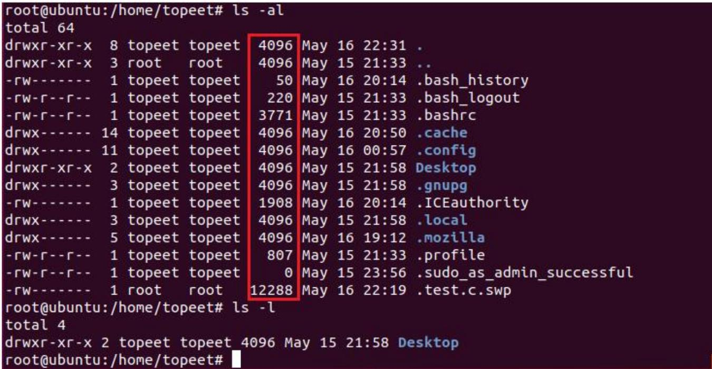

### 第五列是修改时间
- 2 修改时间表示的是最后的修改时间

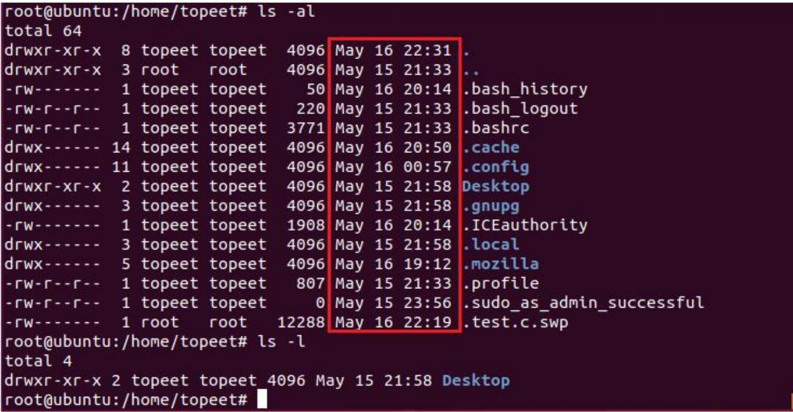

### 最后一个参数表示文件名：

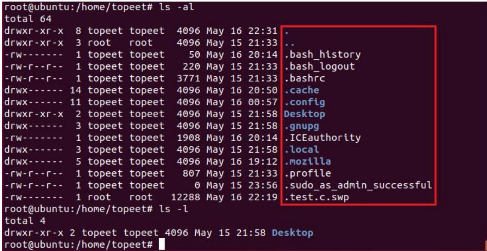

### .表示的是当前目录，.. 表示的是上一级目录。

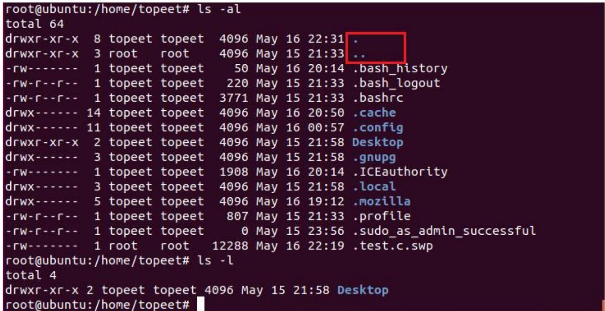

> 除了“- a”“- l”这两个参数以外，还有- t- s等参数，但一般常用的还是- a和- l参数。

## 7.2 cd 命令：目录切换

> 这里有一个小技巧，**输入这个文件第一个首字母，然后按Tab键，系统会帮我们自动补全**，就不用输入文件的全部名称了。

## 7.3 pwd命令：显示当前路径


# 四、 常用命令第二部分

## 10.1 、mkdir命令：创建一个新的文件夹

> 使用mkdir命令也可以创建多级目录，**创建多级目录使用- p参数**。在test这个文件夹里，创建一个名为test1的文件，然后在test1的文件夹里再创建一个名为test2的文件。一个一个创建就太麻烦了，可以使用mkdir命令加上- p参数创建多级目录，这里test路径就是相对路径，然后在这里创建一个test1，在test1下面再创建一个test2，然后进到test文件夹里，下边就有了一个test1的文件，然后进到test1里面，同样里面有一个test2的文件夹，输入以下命令完成上述内容，如下图所示：
- 2 mkdir - p test/test1/test2

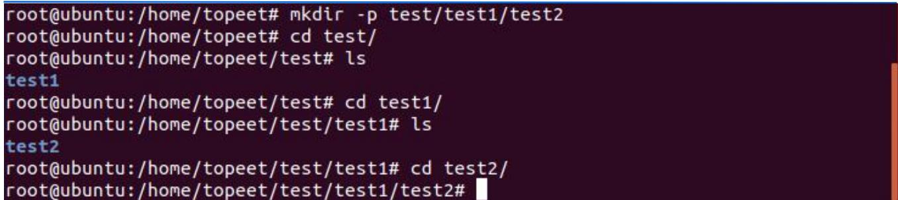

## 10.2、rmdir命令：删除一个空目录

## 10.3、rm命令：删除文件或者目录

> 注意：**删除目录一定要加上- r参数**
这个命令有三个常用的参数为- r- f- i，下面将一一进行介绍。

- 2 rm - r test/


> **- f参数可以对此进行强制删除**。**-i参数是在删除文件之前进行询问**。使用以下命令来删除test目录如下图所示：

- 2 rm - ri test/
root@ubuntu:/home/topeet# ls Desktop test root@ubuntu:/home/topeet# rm - ri test/ rm: remove directory 'test/'?


## 10.4 、touch 命令：创建一个文件


## 10.5 、clear 命令：刷新屏幕，但是会保留历史记录。

## 10.6 、reset 命令：重新初始化屏幕，历史记录也会被清除。


## 10.7 、cp 命令：复制文件或者复制目录

- 1 命令格式：cp 源文件 目标文件

> cp 命令不仅可以复制文件，也可以复制文件夹。**复制文件夹要加上一个 - r** 参数，- r 参数：**递归复制**，要把源文件夹下所有的东西都复制到目标文件夹中去，使用以下命令将 test 文件夹复制为 test1，如下图所示：


## 10.8 、mv命令：修改文件名、修改目录的名称、移动文件

> **移动多个文件可以使用通配符`*`代表任意**。比如在test这个目录下分别创建testl.c、test2. c、test3. c文件

- 2 mv .test3/\*

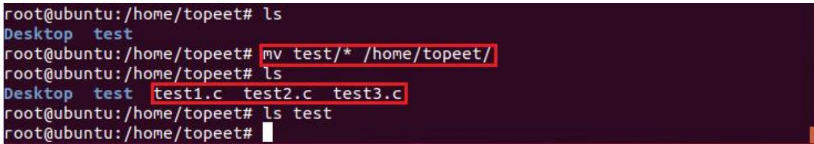

## 10.9 tar 命令：对文件和目录进行打包

- 1 格式：tar [参数] 压缩文件名 要压缩的目录或者文件的名字

### 常用参数如下：
> `- c`：**创建**一个新的打包文件，
> 
> `- x`：对打包文件进行**解压缩**
> 
>` - z:`**gzip格式**进行压缩或者解压，与这个参数常结合的有c和x这个参数，如果与c结合，他就是压缩，如果与x结合，他就是解压缩。<span style="background:#d3f8b6">后缀tar.gz</span>
> 
>` - j`：以**bzip2的格式**进行压缩或者解压。如果与c结合，他就是压缩，如果与x结合就是解压缩，<span style="background:#d3f8b6">后缀tar.bz2</span>
> 
> `- f`：表示**要操作的文件**，一般放在所有参数最后面，
> 
>` - v`：**显示现实正在处理的文件**
> 
> `- C`：格式-C路径，表示将压缩文件**解压到指定路径**。

### 举例：

#### bzip2的格式
- 1 生成了bz2的压缩包
- 2 tar - cjf test.tar.bz2 test/


- 1 解压缩bz2的压缩包
- 2 tar - xjf test.tar.bz2

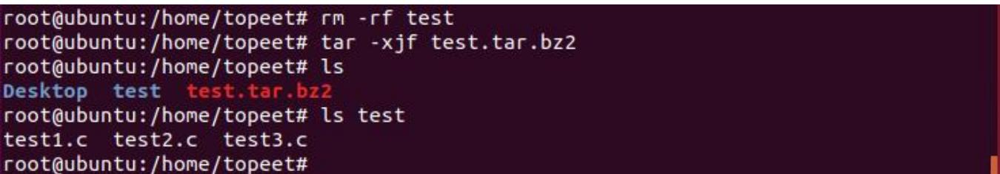

#### gzip格式
- 1 以 gzip 的方式进行压缩
- 2 tar - czvf test.tar.gz test/

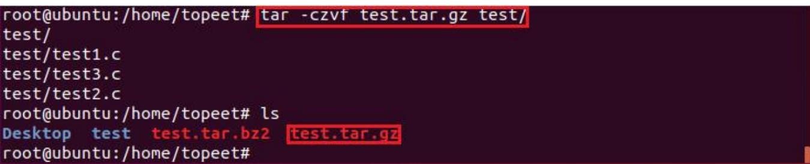

- 1 以 gzip 的方式解压文件。
- 2 tar - zxf test.tar.gz

#### - C 参数
> **将压缩文件解压到固定路径下**，比如使用以下命令将 test.tar.gz 这个压缩包解压到 /home 路径下，

- 2 tar - zxf test.tar.gz - C /home/

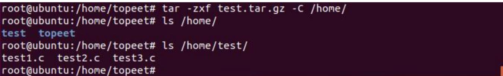

## 10.10、ifconfig命令：查看和配置网络状态

### 设置ip地址格式：
- 1 ifconfig 网卡名称 新ip地址

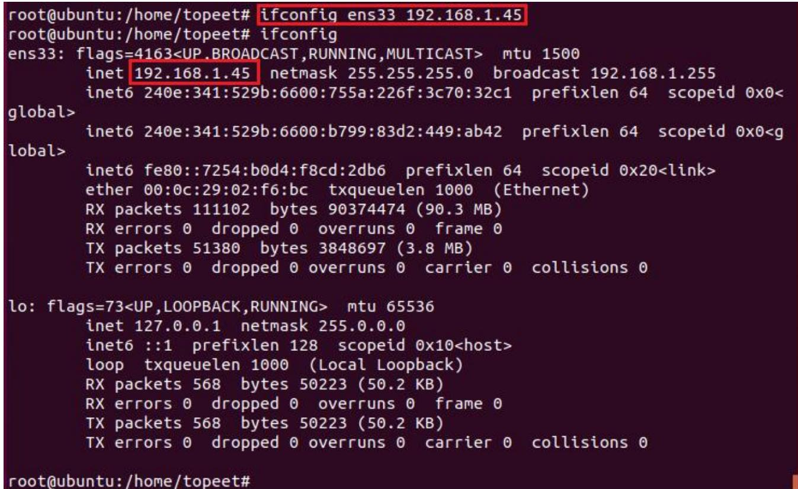


### 关闭网卡
- 1 ifconfig 网卡名称 down


- 2 ifconfig ens33 down

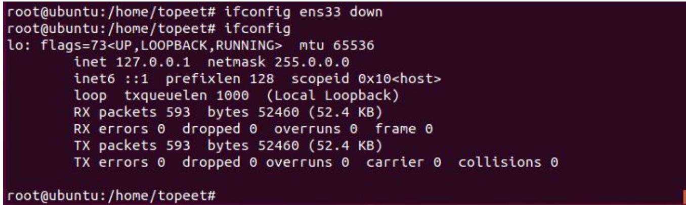

### 打开网卡
- 1 ifconfig 网卡名称 up

- 2 ifconfig ens33 up
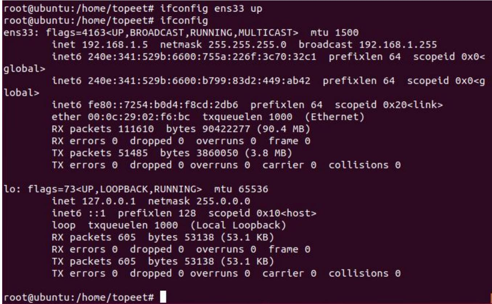

## 10.11、cat命令：查看文件内容

> **- b参数：对输出的行进行一个行编号**举例，使用以下命令对test.c文件进行查看，也可以加一些参数比如- b

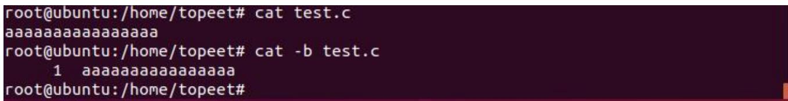

## 10.12、reboot命令：重启系统


## 10.13、poweroff命令：关机


## 10.14、ipconfig命令：查看win电脑的ip

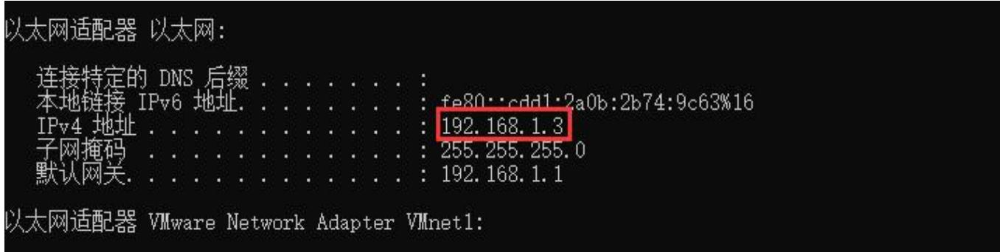

## 10.15、 ping 命令：测试本机与目标机器的网络

> ping 命令可以**测试本机与目标机器的网络是否联通、速度如何、稳定性**如何。win 电脑的 ip 为 192.168.1.3，来 ping 一下这个命令，**- c 指定ping次数后停止**。

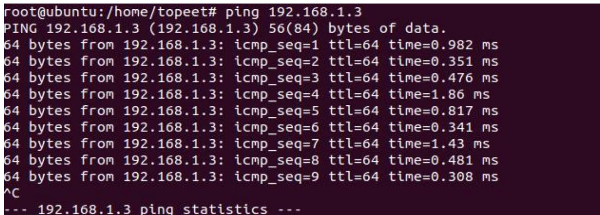

> 在这个命令下加- c3，会在ping三下后自动停止，不加- c参数它就会不停地ping下去，可以**通过“ctrlc"组合按键来停止**。


> 目标机器可以是 ip，也可以是域名，如果是**域名，要保证 dns 是正确的**。输入以下命令ping 百度的域名，如下图所示：

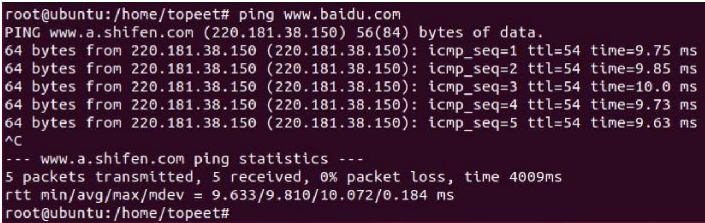

## 10.16、 find 命令：用于在目录结构中查找文件。

> **find 路径 参数 查找信息**
> 路径表示要查找的目录路径，如果不指定路径，则会在当前目录下进行查找。查找信息可以是文件名也可以是文件名的一部分。

### 主要参数如下：

>` - name `**按照文件名称查找**，查找与 filename 匹配的文件，可使用通配符。
>
>`-depth` **从指定目录下的最深层的子目录开始查找**。
>  
> `-gid `<群组识别码> 查找符合指定的群组识别码的文件或目录。
> `-group `<群组名称> 查找符合指定的群组名称的文件或目录。
> `-size` <文件大小> 查找**符合指定文件大小**的文件。
> `-type` <文件类型> 查找符合指定**文件类型**的文件。
> `-user` <拥有者名称> 查找**符合指定的拥有者名称**的文件或目录。
> 
> 而我们一般所用到的参数为-name 参数，用来查找对应文件所在的路径，例如我们在 /home/topeet 目录下使用以下命令来查找 test 文件所在的路径，如下图所示：

- 2 find -name "test"    使用通配符（需要引号）


由于没指定路径，所以查询的路径为当前目录，可以看到 test 文件的路径被打印了出来。其它参数的使用大家可以自行来练习一下，使用的最多的仍是- name 参数。


```c
# 方法1：使用通配符（需要引号）
find -name "*tuning*.bin"

# 方法2：指定搜索路径
find . -name "*tuning*.bin"

# 方法3：更详细的搜索
find . -type f -name "*tuning*.bin"
```


## 10.17 、grep 命令：用于查找文件中包含指定关键字的内容

- 1 grep 参数 查找信息 路径

路径表示要查找的目录路径，如果不指定路径，则会在当前目录下进行查找。

### grep 命令的主要参数如下：
>` - b` 在显示符合关键字的那一列前，**标记处该列第 1 个字符的位编号**。
>
> `- c `**计算符合关键字的列数**。
> 
> `- i `**忽略字符大小写**。
> 
> `- r` 在指定目录中**递归查找**。
> 
> `- n` **显示查找内容的行号**。


> 而**通常所用到的参数为- nr**，用来查找对应内容所在的路径和行号，例如在/home/topeet 目录下使用以下命令来查找“beijing”内容的对应文件及行号，如下图所示：

- 2 grep - nr beijing

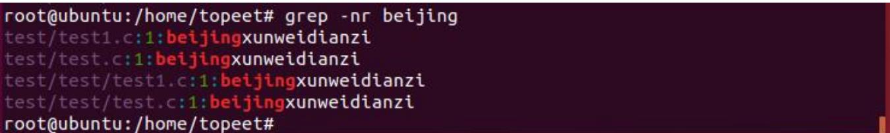

### sudo grep -rn "mmcblk0p12" .


# 五、 帮助手册讲解

Linux 的命令是在是太多了，不可能把所有的命令所有的参数都记下来，需要查看某个命令某个参数的时候，我们不必去网上找，通过 linux 的帮助手册，进行查看就可以了。

## 11.1 打开帮助手册：man man

### 帮助手册的每一页功能
> 1. **可执行的程序或者 shell 命令**  
> 2. **系统调用**  
> 3. 库调用  
> 4. 设备和特殊文件的帮助，通常在 /dev 下面  
> 5. 配置文件的帮助  
> 6. 游戏的帮助  
> 7. 杂项的帮助  
> 8. 超级用户可以执行的系统命令的帮助  
> 9. 内核相关的。
> 10. 直接**按 q 就可以退出了**。

## 11.2以页数的方式查看
- 1 man 1 ls

root@ubuntu:/home/topeet# root@ubuntu:/home/topeet# man 1 ls

1代表第一页，会弹出ls命令的介绍，每个参数都有对应的介绍，如果想知道某个参数的具体作用，就可以使用这个办法来查，在手册左上角有LS1，1就代表第一页，按q可以直接退出。

## 11.3查看命令的所在页数

> 可以**使用- f参数来查看命令拥有哪个级别的帮助**，来查看该命令所在的页数。比如说输入以下命令来查看cd命令所在的页数

- 2 man - f cd

root@ubuntu:/home/topeet# man - f cd cd (1posix) - change the working directory root@ubuntu:/home/topeet#

可以看到这里提示在1posix，所以cd命令在第1页就可以找到了。

> 如果说每个命令的使用，都去网上或者翻阅书籍就太麻烦了，而且网上有的并不权威，很多都没有经过验证。使用ubuntu的man命令来查看是**最权威，最准确的方法**。


# 六、linux常用命令总结（简洁）

## 启用root用户
### 1 、更新密码（sudo passwd）


### 2 、启用root用户（su root）


### 3 、退出root用户（exit）


### 4 、命令行的组成


- 1 ~ 当前用户目录路经
### 5、`sudo -i #切换到root用户`（ubuntu22）


## Ubuntu使用apt-get下载
### 1 、apt-get 命令常用使用方法

- 1 apt-get update                更新下载源
- 1 apt-get install xxx           安装  软件

- 1 sudo apt remove xxx       卸载软件

### 2 、


## Linux常用命令
### 1 、ls  （显示文件信息）

- 1 -a    显示所有文件
- 1 -l      显示文件的所有信息
- 1 

#### ls -al 显示信息分析

### 2 、cd （改变工作目录）


- 1 cd .. 
### 3 、pwd (查看当前所处的路径)


- 1 pwd -P      显示文件的实际位置（软链接）
### 4 、mkdir（创建一个文件夹）


- 1 mkdir -p test/test1             使用-p 参数 可以创建多级目录

### 5、rmdir（删除非空目录）


### 6、touch（创建一个文件）


### 7、rm（删除文件或目录）


- 1 rm -r test              递归删除这个目录下所有的子目录，包括目录本身
- 1 -rf表示强制删除，-ri会询问是否删除

- 1 .使用rm命令时，其后面可以加多个要删除的目标
### 8、cp（复制）


- 1 cp 源文件 目标文件
- 1  cp 源文件 路经

### 9、mv（移动、修改名字）


- 1 mv 源文件名 想改成的文件名
- 1 mv 想要移动的文件的路径 要移动到哪里
- 1 移动多个文件我们的可以通配符 *
### 10、tar （压缩和解压命令）

- 1 `-c`: 创建一个新的归档文件。
- 1 `-v`: 显示处理的文件（可选）。
- 1 `-f`: 指定归档文件名。
- 1 `-z`: 使用 gzip 进行压缩
- 1 `-j`: 使用 bzip2 进行压缩。
- 1 `-x`: 从归档中提取文件。

| 文件类型           | 压缩命令                         | 解压命令                     |
| -------------- | ---------------------------- | ------------------------ |
| **`.tar.gz`**  | `tar -czvf file.tar.gz dir`  | `tar -xzvf file.tar.gz`  |
| **`.tar.bz2`** | `tar -cjvf file.tar.bz2 dir` | `tar -jxvf file.tar.bz2` |
| **`.tar.xz`**  | `tar -cJvf file.tar.xz dir`  | `tar -Jxvf file.tar.xz`  |


### 11、 ifconfig（查看和配置网络状态）


- 1 ifconfig 网卡名称 down                功能:关闭网卡
- 1 ifconfig 网卡名称 up                     功能:打开网卡
- 1 ifconfig 网卡 IP                             设置IP 地址
- 1 
### 12、cat 命令（查看文件的内容）

- 1 -b 对输出的行进行一个编号

### 13、 reboot（重启系统）


### 14、poweroff（关闭系统）


### 15、ipconfig（查看win电脑的ip）


### 16、ping（测试网络）


- 1 ping ip地址 -c 次数

### 17、chmod（修改权限）

- 1 chmod 权限(二进制) 文件名

### 18、df（显示磁盘分区上的可以使用的磁盘空间、显示文件系统的类型）


- 1 df -Th
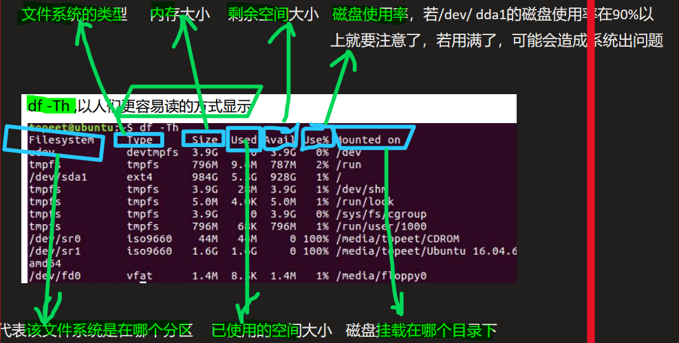

- 1 分区即为磁盘
### 19、gcc（本地c语言编译器）


- 1 gcc -v 查看ubuntu的gcc
- 1 gcc 源文件 -o 生成程序名

### 20、file（查看文件类型）


### 21、ps -aux  -查看进程

> xgrids@lixel:/etc/systemd/system$ `ps aux | grep btgatt-server`
> xgrids      2998  0.0  0.0   4736   644 pts/0    R+   15:28   0:00 grep --color=auto btgatt-server


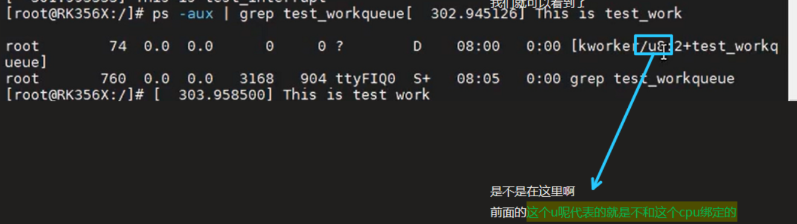

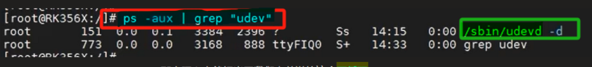

- 1 ps -a          显示终端上的所有进程
- 1 ps -au        显示我们进程的归属用户以及相关的内存使用情况
- 1 ps -aux      显示的是不关联我们终端的进程
- 1 ps -aux | grep aux    查找我们想要的进程。组合命令

#### 命令执行分析


### 22、kill - 杀死进程


- 1 kill -l     查看都有哪些信号，一般都用9信号
- 1 kill -9 PID号

- 1 当一个控制台卡住的时候，可以另开一个控制台来执行命令


### 23、ipcs （查看通道）

- 1 ipcs -m    查看共享内存
- 1 ipcs -q     查看消息队列


### 24、ipcrm -m shmid号（删掉共享内存）


### 25、


# 七、linux命令扩展

## **`grep` 命令**（匹配文件内的内容）

**用途**：<span style="background:#b1ffff">在文件中搜索指定字符串或正则表达式。  </span>
**基本语法**：

bash

复制

`grep "参数名" 文件名`  

**常用选项**：

- `-n`：显示匹配行的行号（适合定位参数位置）。
- `-i`：忽略大小写（如 `grep -i "port" config.txt` ）。
- `-r`：递归搜索目录下所有文件（如 `grep -r "debug_mode" /etc/`）。
- `-w`：精确匹配单词（避免部分匹配，如 `grep -w "Timeout" file.conf` ）。


### **特殊场景处理**

1. **参数含特殊字符（如空格、引号）**：
    - **Linux**：用单引号包裹参数（如 `grep 'param with space' file`）。
    - **Windows**：用双引号包裹参数（如 `findstr /C:"param with space" file`）。
2. **检查程序启动参数（如进程的命令行参数）**：
    - **Linux**：`ps aux | grep "进程名"` 显示命令行参数。
    - **Windows**：`wmic process where Caption="程序名.exe" get CommandLine` 查看完整启动参数。

---


## **uname -m命令**

<span style="background:#d3f8b6">直接查看系统的硬件架构：</span>

<span style="background:#b1ffff">uname -m</span>

```
uname -m
```

**输出示例：**

深色版本

```
x86_64          # 表示 64 位系统（常见的 PC 架构）
arm64           # 表示 ARM 64 位架构（如树莓派、某些嵌入式设备）
i686/i386       # 表示 32 位系统（已较少见）
```

## 如何查看.ko内核模块的内核源码版本（modinfo）

ming@ming:~/workspace/appfs/lib/modules$ 
<span style="background:#b1ffff">modinfo atbm6x3x_wifi_usb.ko | grep "vermagic"</span>
modinfo atbm6x3x_wifi_usb.ko | grep "vermagic"

vermagic:       <span style="background:#affad1">3.10.14__isvp_pike_1.0__ </span>preempt mod_unload MIPS32_R1 32BIT 

内核源码版本没问题


## make strip
  
在嵌入式开发或软件构建过程中，`make strip` 并不是一个标准的 `make` 命令或者目标(target)。不过，“strip” 是一个与编译和链接过程密切相关的操作，<span style="background:#affad1">通常用于减少二进制文件的大小。</span>让我解释一下这个术语以及如何在项目中使用它。

### 术语解释

- **Strip**: 在计算机编程中，strip 是指从可执行文件、库文件或其他目标文件中<span style="background:#affad1">移除调试信息和其他非必要的数据的过程。</span>这有助于减小文件大小，提高加载速度，并保护源代码的细节不被轻易获取。通常通过 GNU binutils 中提供的 `strip` 工具来完成这一操作。

[strip](https://so.csdn.net/so/search?q=strip&spm=1001.2101.3001.7020)经常用来去除目标文件中的一些符号表、调试符号表信息，以减小程序的大小。
Strip使用的要注意什么？
在实际的开发中， 经常需要对动态库.so进行strip操作， 减少占地空间。 而在调试的时候（比如用addr2line）， 就需要符号了。 因此， 通常的做法是： strip前的库用来调试， strip后的库用来实际发布， 他们两者有对应关系。 一旦发布的strip后的库出了问题， 就可以找对应的未strip的库来定位。

 

目标文件分为：可重定位文件、可执行文件、共享文件

-e

在对象文件的可选头中设置 F_LOADONLY 标志。如果对象文件放置在归档中，则该标志告知绑定程序（ld 命令），在与此归档链接时应忽略该对象文件中的符号。

-E

复位（关闭）对象文件的可选头中的 F_LOADONLY 位。（请参阅 -e 标志。）

-H

除去对象文件头、任何可选的头以及所有段的头部分。

注：不除去符号表信息。

-l

（小写 L）从对象文件中除去行号信息。

strip的默认选项会去除.symbol节的内容以及.debug节的内容，因此尽量只对可执行文件执行strip而不要对静态库或动态库等目标文件strip。

### 命令脚本遍写
```
# 定义 'strip' 目标，用于执行特定内核模块文件的剥离操作，减少文件大小 strip: # 使用 $(CROSS_COMPILE)strip 命令对位于 $(WIFI_INSTALL_DIR) 目录下的 $(MODULES_NAME).ko 文件执行剥离操作。 # --strip-unneeded 参数指示 strip 工具仅保留运行时所需的最少符号信息，移除所有非必要的符号和调试信息。 # $(CROSS_COMPILE) 是交叉编译器的前缀，如 "arm-linux-gnueabihf-"，确保使用的 strip 工具与目标架构相匹配。 # $(WIFI_INSTALL_DIR) 代表内核模块的安装路径，$(MODULES_NAME) 则是模块的名称。 $(CROSS_COMPILE)strip $(WIFI_INSTALL_DIR)/$(MODULES_NAME).ko --strip-unneeded
```


```
#CROSS_COMPILE:=mips-linux-gnu-

PWD:=$(shell pwd)
INSTALL_DIR := $(PWD)/
MODULES_NAME:= audio

strip:
	$(CROSS_COMPILE)strip $(INSTALL_DIR)/$(MODULES_NAME).ko --strip-unneeded
```


## **直接检查命令是否存在**（command -v）

在终端中运行以下命令：


```
command -v lzop
```


## make distclean
<span style="background:#affad1">去掉所有的配置，包过.config</span>


## ubuntu终端翻回上一次所在位置的命令

### **1. `cd -` 命令**

- **功能**：快速切换到上一次所在的目录。

- **特点**：
    
    - 每次执行 `cd -` 会在当前目录和上一次目录之间**来回切换**。
    - 如果连续使用 `cd -`，会不断在两个目录间切换。


### **方法3：使用 `pushd` 和 `popd`**

- **保存并返回目录**：
    
    ```
    pushd ~/Documents   # 进入目录并保存当前位置到栈
    pushd ~/Downloads   # 进入另一个目录
    popd               # 返回上一个栈中的目录（~/Downloads）
    popd               # 返回上一个栈中的目录（~/Documents）
    ```
    

---

### **3. 注意事项**

- **`cd -` 的限制**：
    
    - 只能返回**最近一次**的目录，不能直接跳转到更早的历史位置。
    - 如果需要多次切换，建议使用 `pushd` 和 `popd` 管理目录栈。
- **结合其他命令**：
    
    - 如果需要记录多个目录，可以手动记录路径或使用脚本辅助。


## **查看命令历史**（history）

- **命令**：`history | grep "cd "`  
    可以查看所有 `cd` 命令的历史记录，然后通过 `!编号` 执行特定命令。例如：

    ```
    history | grep "cd"  # 查看历史 cd 命令
    !123                # 执行历史记录中的第123号命令
    ```


## ls 命令的全部参数
`ls` 命令是类Unix系统（包括Linux）中用于列出目录内容的命令。它是一个非常强大且常用的工具，支持多种参数来改变其输出格式和行为。以下是`ls`命令的一些常用参数：

- `-a, --all`：显示所有文件，包括以`.`开头的隐藏文件。
- `-A, --almost-all`：显示除`.`和`..`之外的所有文件，包括其他隐藏文件。
- `-b, --escape`：把不可打印字符用八进制反斜杠序列表示。
- `--block-size=SIZE`：按照指定的SIZE单位显示文件大小。
- `-B, --ignore-backups`：忽略备份文件（即忽略以`~`结尾的文件）。
- `-d, --directory`：当遇到目录时，不显示目录里的内容，只显示目录本身。
- `-D, --dired`：产生适合GNU Emacs dired模式使用的输出。
- `-f`：不对输出进行排序，直接按目录顺序列出条目；也可开启`-aU`选项的效果。
- `-F, --classify`：在每个条目后附加一个指示符，例如`/`表示目录，`*`表示可执行文件等。
- `--file-type`：类似于`-F`，但不添加`*`到可执行文件。
- `-g`：类似`-l`，但不列出所有者信息。
- `-G, --no-group`：以长列表格式列出文件时不显示组信息。
- `-h, --human-readable`：与`-l`一起使用，将文件大小以易读的格式显示（如KB、MB等）。
- `-H, --dereference-command-line`：跟随命令行参数中的符号链接。
- `--hide=PATTERN`：隐藏符合PATTERN的文件（除了以`.`开头的文件）。
- `--hyperlink[=WHEN]`：对输出进行超链接处理。
- `-i, --inode`：列出每个文件的inode编号。
- `-k`：类似`--block-size=1K`。
- `-l`：使用长列表格式显示文件详细信息。
- `-L, --dereference`：当显示符号链接的目标而非链接本身。
- `-m`：用逗号分隔项目。
- `-n, --numeric-uid-gid`：类似于`-l`，但使用UID和GID代替用户名和组名。
- `-N, --literal`：直接打印条目名称，不做任何特殊处理。
- `-o`：类似于`-l`，但不列出组信息。
- `-p, --indicator-style=slash`：给目录加上`/`后缀。
- `-q, --hide-control-chars`：以`?`替代无法显示的字符。
- `-Q, --quote-name`：将条目名称用双引号括起来。
- `--quoting-style=WORD`：根据WORD设置引用风格。
- `-r, --reverse`：逆序排列。
- `-R, --recursive`：递归列出子目录内容。
- `-s, --size`：显示每个文件分配的块数。
- `-S`：按照文件大小排序。
- `-t`：按照修改时间排序，最新的排在最前。
- `-T, --tabsize=COLS`：假设制表符停止位置为每列COLS个空格。
- `-u`：配合`-lt`使用，显示并按照访问时间排序；配合`-l`使用，仅显示访问时间。
- `-U`：不排序；按照目录遍历顺序列出条目。
- `-v`：自然排序版本号。
- `-w, --width=COLS`：假设屏幕宽度为COLS个字符。
- `-x`：逐行列出条目而不是逐列。
- `-X`：按照扩展名排序。
- `-Z, --context`：显示安全上下文。

请注意，不同的操作系统或不同的shell实现可能会有一些差异。上述参数适用于大多数现代Linux发行版。要获取更详细的信息，您可以查阅特定于您的系统的`ls`命令的手册页(`man ls`)。


## file 文件
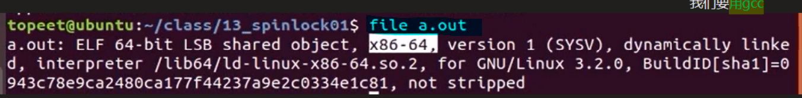


## ./文件 &  -后台运行

## 运行起来后Ctrl+z（切换到后台）


##  pkill - 向所有匹配该名称的进程发送一个默认的TERM信号。

- 1 pkill <进程名>         
- 1 可以直接根据进程名发送信号而不需要先找出PID。
- 1 pkill -9 <进程名>       可以用来强制杀死这些进程。


## mount 命令
将编译之后的内核镜像烧写到开发板上,接着使用 mount 命令<span style="background:#affad1">检査configfs 虚拟文件系统</span>
<span style="background:#affad1">是否挂载成功</span>。挂载成功如下图(图 82-3)所示:
[“13_移植设备树插件驱动”页上的图片](onenote:#13_移植设备树插件驱动&section-id={951D2BFB-3DD0-4B4D-B5B7-D7DAD35449EE}&page-id={667EC765-C643-4716-A0B2-1A060EE586B6}&object-id={029FE9E5-EC3E-4FFE-9A9C-33F402BBD11F}&25&base-path=https://d.docs.live.net/52d4b76bb0ffcf51/Documents/\(RK3568\)Linux驱动开发/第八期_设备树插件.one)


## dmesg | grep TTFF

> [!note] TTFF
> 在嵌入式 Linux 系统中，您可以通过以下命令查看 GPS 模块的 TTFF（Time To First Fix，首次定位时间）相关日志：


## make menuconfig中搜索功能。


> [!note] 搜索
> 假设搜索 “Wireless LAN”：
> 尝试转义空格：输入 Wireless\ LAN。
> 改用下划线：搜索 Wireless_LAN 或 WIRELESS_LAN。
> <span style="background:#affad1">搜索部分词：输入 Wireless 或 LAN，在结果中手动查找</span>。
> 查找符号名：若找到选项，通过帮助页确认其实际为 CONFIG_WLAN，后续直接搜索 WLAN。

## 查看软件版本  （-v）

- 1 gcc -v


## uboot重启 - reset


## linux系统重启 - reboot


## 修改一个目录下所有文件的所有者（不要用这个来改文件系统，会导致不能用）
- 1 sudo chown -R topeet:topeet workdir

- 2 sudo chown -R 用户名:组名 /路径/到/目录

## 查看当前用户所属的组 - groups
- 1 groups

- 3 topeet : topeet adm cdrom sudo dip plugdev lpadmin lxd sambashare docker
- 2 可以看出：主组（Primary Group）是 `topeet`。附加组（Supplementary Groups）则包括：`adm cdrom 等`
- 2 `topeet` 用户主要属于 `topeet` 组，同时还被赋予了上述附加组的权限。


## dmesg - 显示内核环形缓冲区（kernel ring buffer）中的消息
- 1 这些消息包括了系统启动时内核的初始化信息、硬件检测信息以及驱动加载情况等，同时也包含了系统运行过程中内核产生的各种通知、错误和警告信息。

- 3 查找特定设备或驱动的信息：
    ```
    dmesg | grep -i usb
    ```

- **实时监控**：
    - 使用 `-w` 或 `--follow` 参数可以实时显示新添加到内核环形缓冲区的消息。
        ```
        dmesg --follow
        ```

- **清除环形缓冲区**：
    - 注意，`dmesg` 本身没有提供清除内核环形缓冲区的功能。但可以通过写入 `/dev/kmsg` 来达到类似效果（需要有足够权限）：
        ```
        sudo dmesg -c
        ```
        
    - 或者，在较新的系统中，直接使用 `echo > /dev/kmsg`。

- **输出格式与时间戳** 
默认情况下，`dmesg` 的输出不会包含时间戳。但是，可以通过 `-T` 参数来显示相对于当前系统启动时间的消息时间戳，或者通过 `--time-format iso` 等选项来指定时间格式。
```
dmesg -T
```


##  Linux下 VScode以sudo/root权限运行的最新方法

- 1 sudo code --no-sandbox --disable-gpu-sandbox --user-data-dir=/root/.vscode/


## 对比文件更改 - diff
- 3 diff [选项] 文件1 文件2

| 选项                             | 说明                        |
| ------------------------------ | ------------------------- |
| `-r` 或 `--recursive`           | 递归比较目录及其子目录中的文件。          |
| `-u` 或 `--unified`             | 生成统一格式的差异输出（含上下文，适合生成补丁）。 |
| `-c` 或 `--context`             | 生成上下文格式的差异输出（显示修改行及其上下文）。 |
| `-i` 或 `--ignore-case`         | 忽略大小写进行比较。                |
| `-w` 或 `--ignore-all-space`    | 忽略空格和制表符（Tab）的差异。         |
| `-b` 或 `--ignore-space-change` | 忽略空格数量的差异（如多个空格视为一个）。     |
| `-B` 或 `--ignore-blank-lines`  | 忽略空白行的差异。                 |
| `-q` 或 `--brief`               | 仅显示文件是否相同，不显示具体差异。        |
| `-s`                           | 报告两个文件相同（默认不输出任何内容）。      |
- 1 diff -r dir1 dir2      递归比较两个目录
- 2 - **输出**：列出两个目录下所有不同文件、新增文件、删除文件等信息。

## sf - 在uboot下对flash操作
> `sf probe 0
> 
> `sf erase 0x0 0x2000000
> 
> `sf read 0x50000000 0x0 16`      # 读取前16字节到内存
> 
> `md 0x50000000 4 `              # 查看内容，若为 FF FF FF FF，表示擦除成功


## size命令（查看可执行文件的内存分布）
[[嵌入式知识学习（通用扩展）/linux基础知识/assets/🔨linux常用命令记录/file-20250810171436059.png|Open: Pasted image 20250707224443.png]]
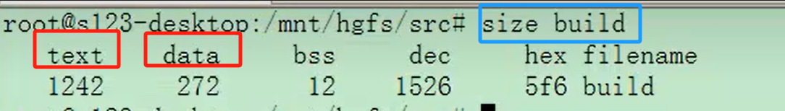


## vsp（vi编辑器的命令）
[[嵌入式知识学习（通用扩展）/linux基础知识/assets/🔨linux常用命令记录/file-20250810171436144.png|Open: Pasted image 20250708220557.png]]
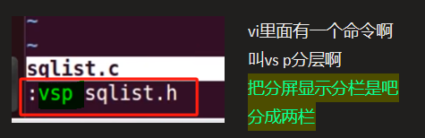

## gcc链接多个文件生成可执行文件
[[嵌入式知识学习（通用扩展）/linux基础知识/assets/🔨linux常用命令记录/file-20250810171436234.png|Open: Pasted image 20250708220720.png]]
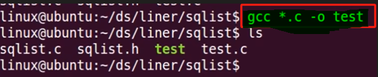


## 查看公网IP命令
> </html>mingyuan@mingyuan-virtual-machine:~$ `curl -s ipinfo.io/ip
157.122.74.148mingyuan@mingyuan-virtual-machine:~


## tree -L 1  （查看当前目录第一级文件结构）


## `find . -name "wpa_supplicant.conf"  `（查找文件位置）
```c
find <搜索路径> <匹配条件>

find . -name "*mount*"


```


## `-p`选项正确保留属性。


## `mkdir -p /root/fasync`：- `-p`：递归创建目录，自动创建路径中所有不存在的父目录（如 `/root` 不存在时也会创建）。


## 查看当前串口终端用的是那个串口节点（ps）
> [root@topeet:~]# ps
>   PID TTY          TIME CMD
>   772 `ttyFIQ0 ` 00:00:00 sh
>   931 ttyFIQ0  00:00:02 read
>   941 ttyFIQ0  00:00:00 ps


## io：读取物理内存或 I/O 端口地址
```c
io -r -4 0xFDC2000C
```

> - **`io`**: 命令名称，代表一个用于内存/寄存器 I/O 操作的工具。
> - **`-r`**: 操作模式。这个选项通常代表 **“Read”**，即读取操作。它告诉工具你想要从指定地址读取数据。
> - **`-4`**: **数据宽度**。这个选项指定了要读取的数据大小。
>     - `-1` 通常代表 1 字节 (8 位, Byte)
>     - `-2` 通常代表 2 字节 (16 位, Half-Word)
>     - `-4` 代表 **4 字节 (32 位, Word)**
>     - 有时也可能是 `-b`, `-h`, `-w` 分别代表 byte, half-word, word。

- 2 从物理地址 `0xFDC2000C` 处，读取一个 32 位 (4 字节) 的数据，并将其打印到终端。


## ldd 查看app运行依赖

```
ldd app
```


## netstat -tulpn：查看端口资源被谁占用
```
sudo netstat -tulpn | grep :8554
```

## 杀死进程
- 1 使用 `ps`、`pgrep`、`top` 等工具找到 `rtsp_server` 的进程号 (PID)，例如：
```
ps aux | grep rtsp_server
```

- 1 发送信号终止
```c
kill <PID>

kill -9 <PID>

pkill rtsp_server
# 或
killall rtsp_server


```

## 监控日志输出

> 打开两个终端，其中一个终端输入以下命令，来监控日志输出。
> 
> **sudo tail -f /var/log/syslog**
> 


## echo "xgrids2022" | sudo -S 
```SQL
echo "xgrids2022" | sudo -S systemctl stop product_test_ble.service
echo "xgrids2022" | sudo -S systemctl disable product_test_ble.service
```

> echo 命令输出字符串 "xgrids2022" 作为密码，通过管道 | 将其传递给 sudo -S 命令
> 选项 `-S` 告诉 `sudo` 从标准输入而不是键盘读取密码。


## 直接在 `sudo` 里加环境变量，运行程序
```c
sudo LD_LIBRARY_PATH=/opt/xgrids/modeling/app/install/lib:$LD_LIBRARY_PATH ../bin/lixel_nman
```


## `lsattr` 命令：显示文件或目录的扩展属性


### 使用方法

```bash
lsattr [选项] [文件/目录...]
```

### 常用选项

- `-a`：显示所有文件和目录的属性，包括隐藏文件（以`.`开头的文件）。
- `-d`：如果操作对象是目录，则只列出该目录本身的属性，而非其内容。
- `-R`：递归地列出目录及其子目录中所有文件和目录的属性。
- `-v`：显示文件或目录的版本号（即创建时的系统版本），这个选项不常用。

### 输出解释

执行 `lsattr` 后，输出结果通常包含一系列字符，每个字符代表一种属性。例如：

```bash
----i--------e-- /path/to/file
```

上述输出表示 `/path/to/file` 文件具有以下两个属性：
> - `i`（immutable）：一旦设置后，**文件不能被修改、删除、重命名**，甚至不能更改其权限，除非移除该属性。
> - `e`（extent format）：表示**文件使用了扩展格式存储**，这是现代文件系统为了提高性能而采用的一种方式，通常对用户透明。
> 
> 其他常见属性还包括但不限于：
> - `a`（append only）：**只能向文件追加数据，但不能修改或删除已有的内容**。
> - `s`（secure deletion）：当文件被删除时，其磁盘空间将被安全擦除。
> - `u`（undeletable）：允许恢复已删除的文件。

### 实际应用例子：lsattr filename

1. **查看文件属性**

   ```bash
   lsattr filename
   ```

2. **递归显示目录属性**

   如果想要查看某个目录及其所有子目录和文件的属性，可以使用 `-R` 选项：

   ```bash
   lsattr -R /path/to/directory
   ```

3. **仅查看目录本身的属性**

   若只想查看某目录本身的属性而不关心其内部文件，可以加上 `-d` 选项：

   ```bash
   lsattr -d /path/to/directory
   ```

请注意，要修改这些属性，需要使用 `chattr` 命令，并且某些操作可能要求超级用户的权限。例如，要给一个文件添加不可变属性，可以使用命令 `sudo chattr +i filename`。同样地，移除不可变属性则使用 `sudo chattr -i filename`。通过合理使用这些属性，可以增强系统的安全性以及文件管理的灵活性。

## `fakeroot`的应用场景

|场景|是否需要 `fakeroot`|解压后文件真实属主|能否用于后续打包|
|---|---|---|---|
|**普通用户 + 无 fakeroot**|❌ 不推荐|当前用户（如 `xgrids`）|❌ 打包后文件属主错误|
|**普通用户 + 有 fakeroot**|✅ 推荐|当前用户（但虚拟记录为 root）|✅ 可正确生成属主为 root 的新包|
|**真实 root 用户**|❌ 不需要|`root`（真实）|✅ 可直接用于打包|


## Linux系统关掉密码验证（💌）
```c
sudo passwd -d xgrids-tty
```


## Linux 里实时查看文件内容

```c
 # 显示最后50行并实时追加
tail -f -n 50 /var/log/chrony/chrony.log   
```


## 清除旧的 SSH 主机密钥记录

```c
ssh-keygen -f "/home/ming/.ssh/known_hosts" -R "192.168.55.1"


ssh-keygen -f "/root/.ssh/known_hosts" -R "192.168.55.1"

```