# 备注(声明)：

# 一、总揽

## 1.menuconfig图形化配置界面基本操作

[11_menuconfig图形化配置界面基本操作](onenote:https://d.docs.live.net/52d4b76bb0ffcf51/Documents/\(RK3568\)Linux驱动开发/第一期_驱动基础.one#11_menuconfig图形化配置界面基本操作&section-id={F6EC1735-9AD6-4EB6-B48F-6AFF2AADA112}&page-id={E494A69F-1A78-43D4-B956-88004ED58C8D}&end)  ([Web 视图](https://onedrive.live.com/view.aspx?resid=52D4B76BB0FFCF51%21se8c325913f784bf694d429e5ee2ab2be&id=documents&wd=target%28%E7%AC%AC%E4%B8%80%E6%9C%9F_%E9%A9%B1%E5%8A%A8%E5%9F%BA%E7%A1%80.one%7CF6EC1735-9AD6-4EB6-B48F-6AFF2AADA112%2F11_menuconfig%E5%9B%BE%E5%BD%A2%E5%8C%96%E9%85%8D%E7%BD%AE%E7%95%8C%E9%9D%A2%E5%9F%BA%E6%9C%AC%E6%93%8D%E4%BD%9C%7CE494A69F-1A78-43D4-B956-88004ED58C8D%2F%29&wdpartid=%7b99561758-5254-47CB-8FEB-5D6DB16FBD72%7d%7b1%7d&wdsectionfileid=52D4B76BB0FFCF51!sb8d9d2d7954f45f0acc8eb1d4509a9ba))
### 1.1 Makefile,,config,Kconfig文件的关系
若.config存在，则界面配置为的选项为.config文件。若不存在，为Kfig的默认配置。config可以生成.config

[13_与图形化界面有关的文件](onenote:https://d.docs.live.net/52d4b76bb0ffcf51/Documents/\(RK3568\)Linux驱动开发/第一期_驱动基础.one#13_与图形化界面有关的文件&section-id={F6EC1735-9AD6-4EB6-B48F-6AFF2AADA112}&page-id={23E8BCD1-8EDC-40F6-BF68-2865F57F5653}&end)   ([Web 视图](https://onedrive.live.com/view.aspx?resid=52D4B76BB0FFCF51%21se8c325913f784bf694d429e5ee2ab2be&id=documents&wd=target%28%E7%AC%AC%E4%B8%80%E6%9C%9F_%E9%A9%B1%E5%8A%A8%E5%9F%BA%E7%A1%80.one%7CF6EC1735-9AD6-4EB6-B48F-6AFF2AADA112%2F13_%E4%B8%8E%E5%9B%BE%E5%BD%A2%E5%8C%96%E7%95%8C%E9%9D%A2%E6%9C%89%E5%85%B3%E7%9A%84%E6%96%87%E4%BB%B6%7C23E8BCD1-8EDC-40F6-BF68-2865F57F5653%2F%29&wdpartid=%7b43698572-CF69-4320-9061-E5B16B7EE305%7d%7b1%7d&wdsectionfileid=52D4B76BB0FFCF51!sb8d9d2d7954f45f0acc8eb1d4509a9ba))

## 2.Kconfig(图形化界面)语法讲解

[14_Kconfig(图形化界面)语法讲解](onenote:https://d.docs.live.net/52d4b76bb0ffcf51/Documents/\(RK3568\)Linux驱动开发/第一期_驱动基础.one#14_Kconfig\(图形化界面\)语法讲解&section-id={F6EC1735-9AD6-4EB6-B48F-6AFF2AADA112}&page-id={A814BEAF-65F0-45E0-BBA9-B521278124BC}&end)  ([Web 视图](https://onedrive.live.com/view.aspx?resid=52D4B76BB0FFCF51%21se8c325913f784bf694d429e5ee2ab2be&id=documents&wd=target%28%E7%AC%AC%E4%B8%80%E6%9C%9F_%E9%A9%B1%E5%8A%A8%E5%9F%BA%E7%A1%80.one%7CF6EC1735-9AD6-4EB6-B48F-6AFF2AADA112%2F14_Kconfig%28%E5%9B%BE%E5%BD%A2%E5%8C%96%E7%95%8C%E9%9D%A2%5C%29%E8%AF%AD%E6%B3%95%E8%AE%B2%E8%A7%A3%7CA814BEAF-65F0-45E0-BBA9-B521278124BC%2F%29&wdpartid=%7b69F08FC5-0C65-43A5-85F2-FFE631C75820%7d%7b1%7d&wdsectionfileid=52D4B76BB0FFCF51!sb8d9d2d7954f45f0acc8eb1d4509a9ba))

# 二、

## menuconfig图形化配置界面基本操作
### 1 、选择
[[嵌入式知识学习（通用扩展）/linux驱动入门/第一期 驱动基础/assets/（废弃）扩展：menuconfig图形化配置界面/be3b71237a208ce56f9c33e8a2c95172_MD5.jpeg|Open: 1757339593299.jpg]]
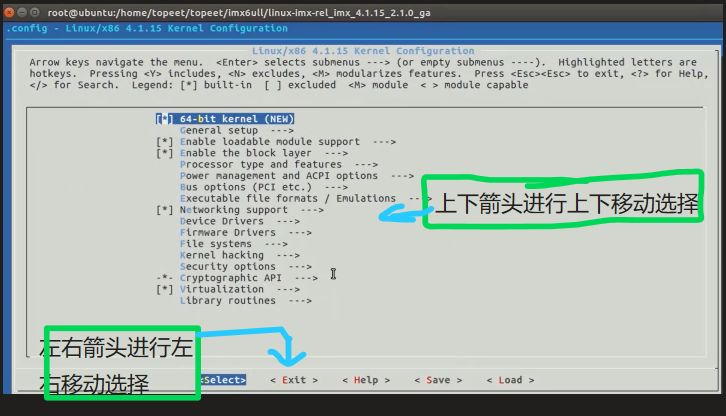

### 2 、搜索和驱动状态
[[嵌入式知识学习（通用扩展）/linux驱动入门/第一期 驱动基础/assets/（废弃）扩展：menuconfig图形化配置界面/9d7b6dff18f9a278ee5960883340c627_MD5.jpeg|Open: 1757339616322.jpg]]
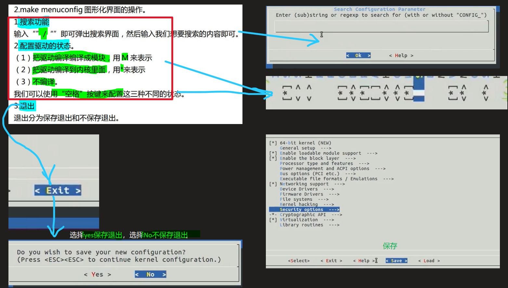

### 3 、

### 4 、

### 5、

### 6、

### 7、

### 8、

## Makefile,.config,Kconfig文件的关系
### 1 、config文件和.config文件

- 1 特色菜：config
[[嵌入式知识学习（通用扩展）/linux驱动入门/第一期 驱动基础/assets/（废弃）扩展：menuconfig图形化配置界面/c27cec007e5f30907d8b7c3e80b6eacb_MD5.jpeg|Open: file-20250908221350444.png]]
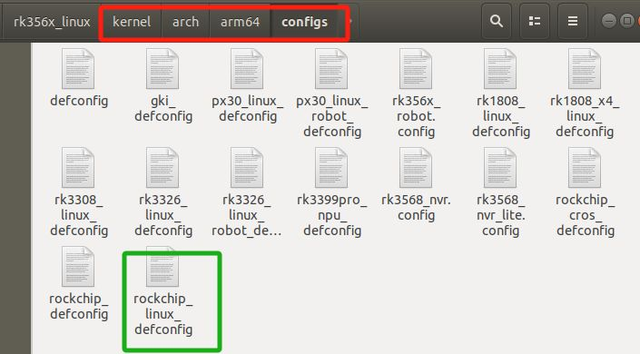

### 2 、Kconfig
[[嵌入式知识学习（通用扩展）/linux驱动入门/第一期 驱动基础/assets/（废弃）扩展：menuconfig图形化配置界面/bb3addd8808afa05c1a06e026505ccf8_MD5.jpeg|Open: file-20250908220941256.png]]
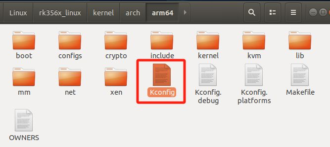
[[嵌入式知识学习（通用扩展）/linux驱动入门/第一期 驱动基础/assets/（废弃）扩展：menuconfig图形化配置界面/8e0cdd7a4d20eac855163d2576c153c7_MD5.jpeg|Open: file-20250908221454787.png]]
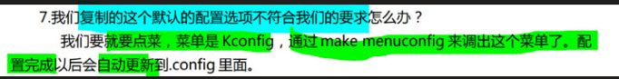

### 3 、Makefile,.config,Kconfig文件的关系
> - `Kconfig 文件`：就像是电脑厂商提供的一个详细的、带逻辑判断的“配置清单”。**清单上列出了所有可选的部件**（CPU型号、内存大小、显卡型号、是否要光驱等），并且告诉你哪些部件是兼容的（比如选了某个主板，就只能选特定的CPU），选了某个高端显卡会自动给你配一个大功率电源。
> - `make menuconfig`: 就是你根据这份清单，在一个**交互界面**上勾选你想要的配置。
> - `.config` 文件：就是你**最终确认的、写下来的配置单**。
> - `Makefile`: 就是工厂的**生产流水线**，它会严格按照你的配置单（`.config`），去仓库（源代码）里拿对应的零件（源文件）来组装你的电脑（编译内核）。

[[嵌入式知识学习（通用扩展）/linux驱动入门/第一期 驱动基础/assets/（废弃）扩展：menuconfig图形化配置界面/11719d4cabadcc75509cf8efadb13452_MD5.jpeg|Open: file-20250908221419390.png]]
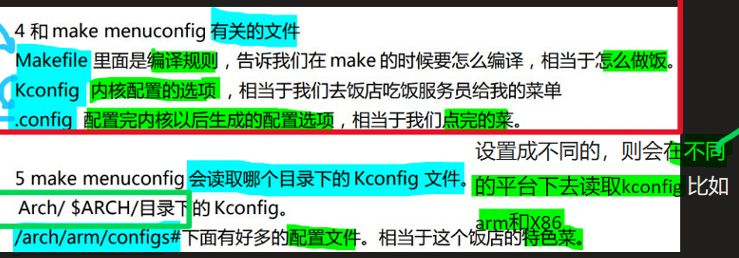

### 4 、配置后宏定义保存文件
- 1 kernel/include/generated/autoconf.h
[[嵌入式知识学习（通用扩展）/linux驱动入门/第一期 驱动基础/assets/（废弃）扩展：menuconfig图形化配置界面/a55ef01dbc926b9eb0b31c821c1a87f1_MD5.jpeg|Open: file-20250908221509537.png]]
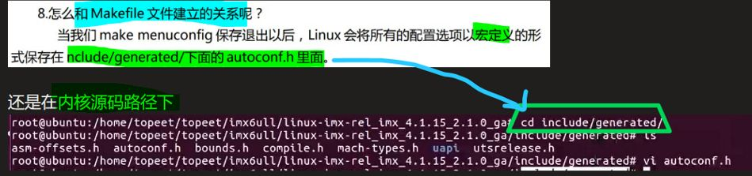

### 6、Makefile：编译规则

### 5、

### 7、

### 8、

## Kconfig(图形化界面)语法讲解
### 1 、mainmenu用来设置主菜单的标题
[[嵌入式知识学习（通用扩展）/linux驱动入门/第一期 驱动基础/assets/（废弃）扩展：menuconfig图形化配置界面/672e256f9b841523b41c7d6822229858_MD5.jpeg|Open: 1757341523233.jpg]]
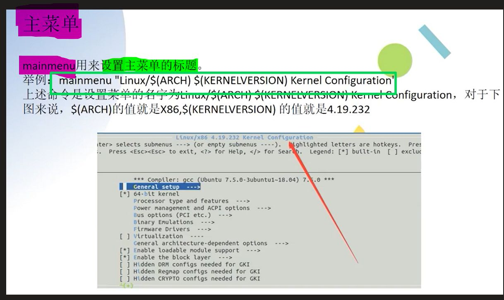

### 2 、菜单结构
[[嵌入式知识学习（通用扩展）/linux驱动入门/第一期 驱动基础/assets/（废弃）扩展：menuconfig图形化配置界面/22eeac73fbb5d267b9c3efadb899e443_MD5.jpeg|Open: 1757341565395.jpg]]
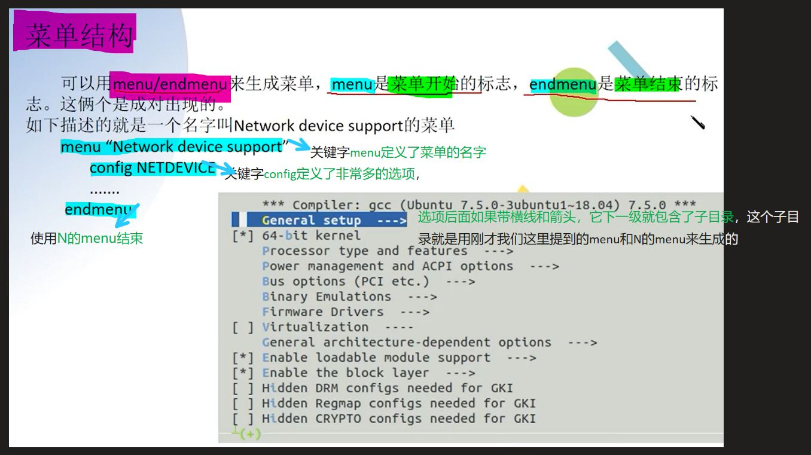

### 3 、配置选项：config
[[嵌入式知识学习（通用扩展）/linux驱动入门/第一期 驱动基础/assets/（废弃）扩展：menuconfig图形化配置界面/ad8d5aba7b88d4314bcc676b0c4b12d1_MD5.jpeg|Open: 1757341595545.jpg]]
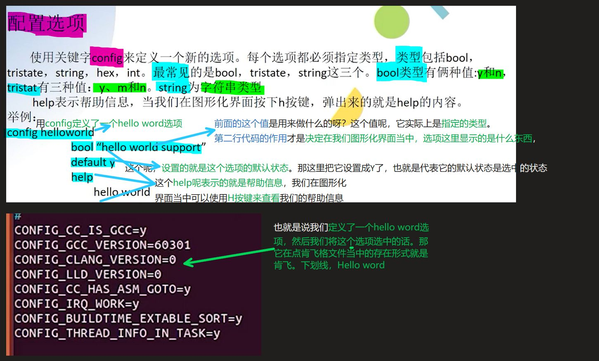

### 4 、依赖关系：depends和select
[[嵌入式知识学习（通用扩展）/linux驱动入门/第一期 驱动基础/assets/（废弃）扩展：menuconfig图形化配置界面/277d5b2db29b64f2a090a37a72d2ccd6_MD5.jpeg|Open: 1757341656963.jpg]]
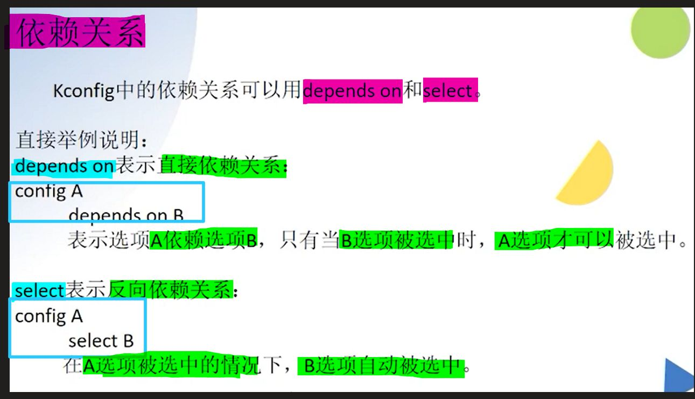

### 5、可选择项：choice和endchoice
[[嵌入式知识学习（通用扩展）/linux驱动入门/第一期 驱动基础/assets/（废弃）扩展：menuconfig图形化配置界面/3420fcfcf0f93c46437113eb8605a771_MD5.jpeg|Open: 1757341671500.jpg]]
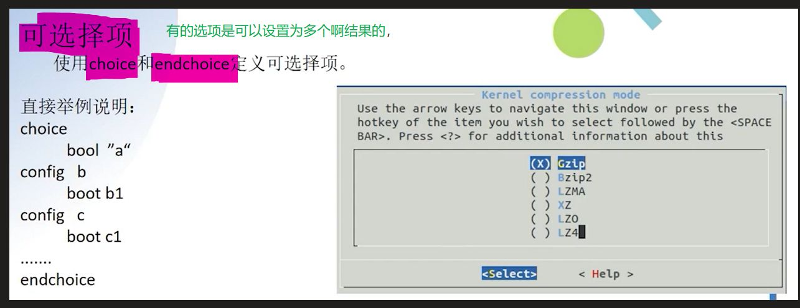

### 6、注释：comment
[[嵌入式知识学习（通用扩展）/linux驱动入门/第一期 驱动基础/assets/（废弃）扩展：menuconfig图形化配置界面/c1c7198cd3fa57fd386b97bb20790e8c_MD5.jpeg|Open: 1757341714929.jpg]]
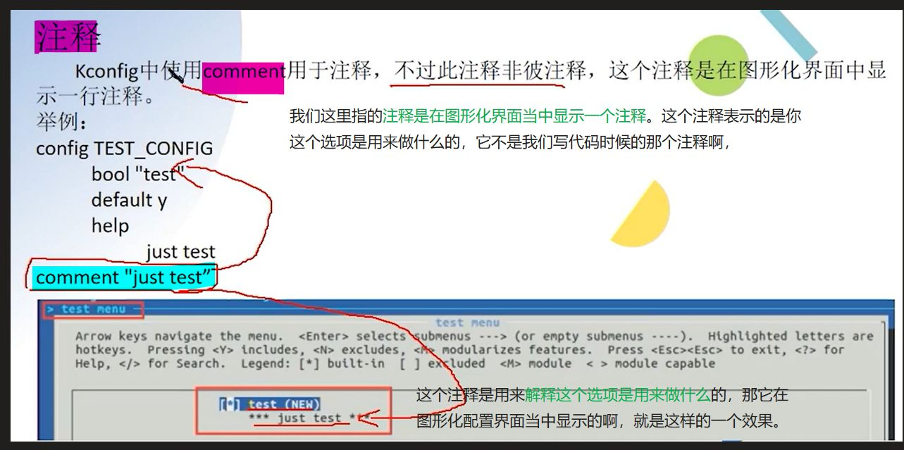

### 7、source：读取另一个kconfig文件
[[嵌入式知识学习（通用扩展）/linux驱动入门/第一期 驱动基础/assets/（废弃）扩展：menuconfig图形化配置界面/5fed41afb9059fd3a6dd3e6513043576_MD5.jpeg|Open: 1757341746039.jpg]]

### 8、

# 三、

## 
### 1 、

### 2 、

### 3 、

### 4 、

### 5、

### 6、

### 7、

### 8、

## 
### 1 、

### 2 、

### 3 、

### 4 、

### 5、

### 6、

### 7、

### 8、

## 
### 1 、

### 2 、

### 3 、

### 4 、

### 5、

### 6、

### 7、

### 8、

# 四、

## 
### 1 、

### 2 、

### 3 、

### 4 、

### 5、

### 6、

### 7、

### 8、

## 
### 1 、

### 2 、

### 3 、

### 4 、

### 5、

### 6、

### 7、

### 8、

## 
### 1 、

### 2 、

### 3 、

### 4 、

### 5、

### 6、

### 7、

### 8、

# 五、

## 
### 1 、

### 2 、

### 3 、

### 4 、

### 5、

### 6、

### 7、

### 8、

## 
### 1 、

### 2 、

### 3 、

### 4 、

### 5、

### 6、

### 7、

### 8、

## 
### 1 、

### 2 、

### 3 、

### 4 、

### 5、

### 6、

### 7、

### 8、

