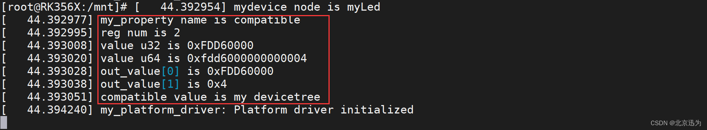

# 备注(声明)：


# 参考文章：


# 一、of操作：获取设备树节点

## of操作函数
### 1 、实际上就是获取device_node结构体(❤️)


### 2 、

## of_find_node_by_name函数
### 3 、通过节点名称查找设备树节点的函数(❤️)


### 4 、详细介绍：

```C
函数原型：

struct device_node *of_find_node_by_name(struct device_node *from, const char *name);

头文件：

#include <linux/of.h>

函数作用：
该函数通过指定的节点名称在设备树中进行查找，返回匹配的节点的 struct device_node 指针。

```


#### 参数含义：

>` from`：指定起始节点，表示**从哪个节点开始查找**。如果 from 参数为 NULL，则从设备树的根节点开始查找。
> 
> `name`：**要查找的节点名称。**
> 
> 返回值：
> 
> 如果找到匹配的节点，则返回对应的 struct device_node 指针。
> 
> 如果未找到匹配的节点，则返回 NULL。


### 5、

## of_find_node_by_path函数

### 6、通过节点路径查找设备树节点的函数


### 7、函数的详细介绍：
```C
函数原型：

struct device_node *of_find_node_by_path(const char *path);

头文件：

#include <linux/of.h>

函数作用：
该函数根据节点路径在设备树中进行查找，返回匹配的节点的 struct device_node 指针。

```

#### 参数含义：
> 参数含义：
> 
>` path`：节点的路径，以斜杠分隔的字符串表示。路径格式为**设备树节点的绝对路径**，例如 /topeet/myLed。
> 
> `返回值：`
> 
> 如果找到匹配的节点，则返回对应的 struct device_node 指针。
> 
> 如果未找到匹配的节点，则返回 NULL。
> 


### 8、


## of_get_parent函数
### 1 、获取设备树节点的父节点


### 2 、函数的详细介绍：
```C
函数原型：

struct device_node *of_get_parent(const struct device_node *node);

头文件：

#include <linux/of.h>

函数作用：
该函数接收一个指向设备树节点的指针 node，并返回该节点的父节点的指针。

```

#### 参数含义：

> **node：要获取父节点的设备树节点指针。**
> 
> 返回值：
> 
> 如果找到匹配的节点，则返回对应的 struct device_node 指针。
> 
> 如果未找到匹配的节点，则返回 NULL。
> 


### 3 、

## of_get_next_child函数
### 4 、获取设备树节点的下一个子节点


### 5、 函数的详细介绍：
```C
函数原型：

struct device_node *of_get_next_child(const struct device_node *node, struct device_node *prev);

头文件：

#include <linux/of.h>

函数作用：
该函数接收两个参数：node 是当前节点，prev 是上一个子节点。它返回下一个子节点的指针。

```


#### 参数含义：

>` node`：当前节点，用于**指定要获取子节点的起始节点**。
> 
> `prev`：上一个子节点，用于**指定从哪个子节点开始获取下一个子节点**。如果为 NULL，则从起始节点的第一个子节点开始。
> 
> 返回值：
> 
> 如果找到匹配的节点，则返回对应的 struct device_node 指针。
> 
> 如果未找到匹配的节点，则返回 NULL。
> 


### 6、


## of_ find_ compatible_ node函数
### 1 、在设备树中查找与指定兼容性字符串匹配的节点。(❤️)


### 2 、函数的详细介绍：
```C
函数原型：

struct device_node *of_find_compatible_node(struct device_node *from, const char *type, const char *compatible);

头文件：

#include <linux/of.h>

函数作用：
在设备树中查找与指定兼容性字符串匹配的节点。
```

#### 参数含义：

>` from`：**指定起始节点**，表示从哪个节点开始查找。如果 from 参数为 NULL，则从设备树的根节点开始查找。
> 
> `type`：**要匹配的设备类型字符串**，通常是 compatible 属性中的一部分。
> 
>` compatible`：**要匹配的兼容性字符串**，通常是设备树节点的 compatible 属性中的值。
> 
> 返回值：
> 
> 如果找到匹配的节点，则返回对应的 struct device_node 指针。
> 
> 如果未找到匹配的节点，则返回 NULL。
> 

### 3 、


## of_ find_matching_node_ and_ match函数
### 4 、根据给定的of_device_id匹配表在设备树中查找匹配的节点。


### 5、函数解析：
```C
函数原型：

struct device_node *of_find_matching_node_and_match(struct device_node *from,const struct of_device_id *matches, const struct of_device_id **match);

头文件：

#include <linux/of.h>

函数作用：
根据给定的of_device_id匹配表在设备树中查找匹配的节点。

```

#### 参数含义：

> `from`：表示**从哪个节点开始搜索**。通常将上一次调用该函数返回的节点作为参数传递给from，以便从上一次的下一个节点开始搜索。如果要从设备树的根节点开始搜索，可以将from参数设置为NULL。
> 
> `matches`：**指向一个of_device_id类型的匹配表**，该表包含要搜索的匹配项。
> 
> `match`：用于**输出匹配到的of_device_id条目的指针**。
> 
> 返回值：
> 
> 如果找到匹配的节点，则返回对应的 struct device_node 指针。
> 
> 如果未找到匹配的节点，则返回 NULL。


### 6、示例代码： 
```c
#include <linux/of.h>
 
static const struct of_device_id my_match_table[] = {
    { .compatible = "vendor,device" },
    { /* sentinel */ }
};
 
const struct of_device_id *match;
struct device_node *np;
 
// 从根节点开始查找匹配的节点
np = of_find_matching_node_and_match(NULL, my_match_table, &match);
```

> 如果找到匹配的节点，将返回该节点的指针，并将**match指针更新为匹配到的of_device_id条目**，函数会自动增加匹配节点的引用计数。


### 7、


### 8、


# 二、实验与测试：

## 实验程序编写
### 1 、编写完成的platform_driver.c代码如下
```c
#include <linux/module.h>
#include <linux/platform_device.h>
#include <linux/mod_devicetable.h>
#include <linux/of.h>
 
struct device_node *mydevice_node;      
const struct of_device_id *mynode_match;
struct of_device_id mynode_of_match[] = {
	{.compatible="my devicetree"},
	{},
};
 
// 平台设备的初始化函数
static int my_platform_probe(struct platform_device *pdev)
{
    printk(KERN_INFO "my_platform_probe: Probing platform device\n");
 
    // 通过节点名称查找设备树节点
    mydevice_node = of_find_node_by_name(NULL, "myLed");
	printk("mydevice node is %s\n", mydevice_node->name);
    
	// 通过节点路径查找设备树节点
    mydevice_node = of_find_node_by_path("/topeet/myLed");
    printk("mydevice node is %s\n", mydevice_node->name);
        
    // 获取父节点
    mydevice_node = of_get_parent(mydevice_node);
    printk("myled's parent node is %s\n", mydevice_node->name);
            
    // 获取子节点
    mydevice_node = of_get_next_child(mydevice_node, NULL);
    printk("myled's sibling node is %s\n", mydevice_node->name);
 
	// 使用compatible值查找节点
	mydevice_node=of_find_compatible_node(NULL ,NULL, "my devicetree");
	printk("mydevice node is %s\n" , mydevice_node->name);
	
	//根据给定的of_device_id匹配表在设备树中查找匹配的节点
	mydevice_node=of_find_matching_node_and_match(NULL , mynode_of_match, &mynode_match);
	printk("mydevice node is %s\n" ,mydevice_node->name);
	return 0;
}
 
// 平台设备的移除函数
static int my_platform_remove(struct platform_device *pdev)
{
    printk(KERN_INFO "my_platform_remove: Removing platform device\n");
 
    // 清理设备特定的操作
    // ...
 
    return 0;
}
 
 
const struct of_device_id of_match_table_id[]  = {
	{.compatible="my devicetree"},
};
 
// 定义平台驱动结构体
static struct platform_driver my_platform_driver = {
    .probe = my_platform_probe,
    .remove = my_platform_remove,
    .driver = {
        .name = "my_platform_device",
        .owner = THIS_MODULE,
		.of_match_table =  of_match_table_id,
    },
};
 
// 模块初始化函数
static int __init my_platform_driver_init(void)
{
    int ret;
 
    // 注册平台驱动
    ret = platform_driver_register(&my_platform_driver);
    if (ret) {
        printk(KERN_ERR "Failed to register platform driver\n");
        return ret;
    }
 
    printk(KERN_INFO "my_platform_driver: Platform driver initialized\n");
 
    return 0;
}
 
// 模块退出函数
static void __exit my_platform_driver_exit(void)
{
    // 注销平台驱动
    platform_driver_unregister(&my_platform_driver);
    printk(KERN_INFO "my_platform_driver: Platform driver exited\n");
}
 
module_init(my_platform_driver_init);
module_exit(my_platform_driver_exit);
 
MODULE_LICENSE("GPL");
MODULE_AUTHOR("topeet");
```

### 2 、关键代码：(❤️)
```c
struct of_device_id mynode_of_match[] = {
	{.compatible="my devicetree"},
	{},
};


// 平台设备的初始化函数
my_platform_probe：：
    // 通过节点名称查找设备树节点
    mydevice_node = of_find_node_by_name(NULL, "myLed");
	
	// 通过节点路径查找设备树节点
    mydevice_node = of_find_node_by_path("/topeet/myLed");    // 获取父节点
    mydevice_node = of_get_parent(mydevice_node);

    // 获取子节点
    mydevice_node = of_get_next_child(mydevice_node, NULL);

	// 使用compatible值查找节点
	mydevice_node=of_find_compatible_node(NULL ,NULL, "my devicetree");
	
	//根据给定的of_device_id匹配表在设备树中查找匹配的节点
	mydevice_node=of_find_matching_node_and_match(NULL , mynode_of_match, &mynode_match);


/{
	topeet {
		#address-cells = <1>;
		#size-cells = <1>;
		compatible = "simple-bus";

		myled {
			compatible = "my devicestree";
			reg = <0xFDD60000 0x00000004>;

		};

	};

};
```


### 3 、


##  运行测试

### 5、insmod platform_driver.ko



> 可以看到总共有4个打印，前两个打印都是查找的myLed节点，第三个打印是查找的myLed的父节点，也就是topeet节点，第四个打印是查找的topeet的子节点，也就又回到了myLed节点。第5个打印是通过compatible属性查找到的myLed节点，第6个打印是通过of_device_id匹配表查找到的myLed节点.
> 


### 6、


## 
### 1 、


### 2 、


### 3 、


### 4 、


### 5、


### 6、


### 7、


### 8、


## 
### 1 、


### 2 、


### 3 、


### 4 、


### 5、


### 6、


### 7、


### 8、


# 三、

## 
### 1 、


### 2 、


### 3 、


### 4 、


### 5、


### 6、


### 7、


### 8、


## 
### 1 、


### 2 、


### 3 、


### 4 、


### 5、


### 6、


### 7、


### 8、


## 
### 1 、


### 2 、


### 3 、


### 4 、


### 5、


### 6、


### 7、


### 8、


# 四、

## 
### 1 、


### 2 、


### 3 、


### 4 、


### 5、


### 6、


### 7、


### 8、


## 
### 1 、


### 2 、


### 3 、


### 4 、


### 5、


### 6、


### 7、


### 8、


## 
### 1 、


### 2 、


### 3 、


### 4 、


### 5、


### 6、


### 7、


### 8、


# 五、

## 
### 1 、


### 2 、


### 3 、


### 4 、


### 5、


### 6、


### 7、


### 8、


## 
### 1 、


### 2 、


### 3 、


### 4 、


### 5、


### 6、


### 7、


### 8、


## 
### 1 、


### 2 、


### 3 、


### 4 、


### 5、


### 6、


### 7、


### 8、


