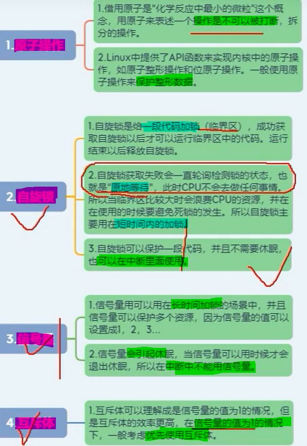
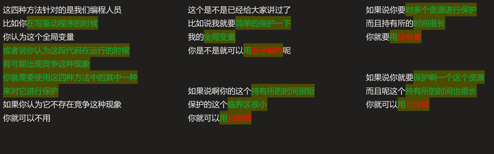

# 并发与竞争的解决方法
[[嵌入式知识学习（通用扩展）/linux驱动入门/第三期 并发与竞争/assets/大纲：/b3ffcd9478614881bcd18e9a2651bc3b_MD5.jpeg|Open: file-20251005153018186.png]]

# 选取优先级

[[嵌入式知识学习（通用扩展）/linux驱动入门/第三期 并发与竞争/assets/大纲：/a89ac315c08305fc78610e7aba017c24_MD5.jpeg|Open: 1759649473178.jpg]]

