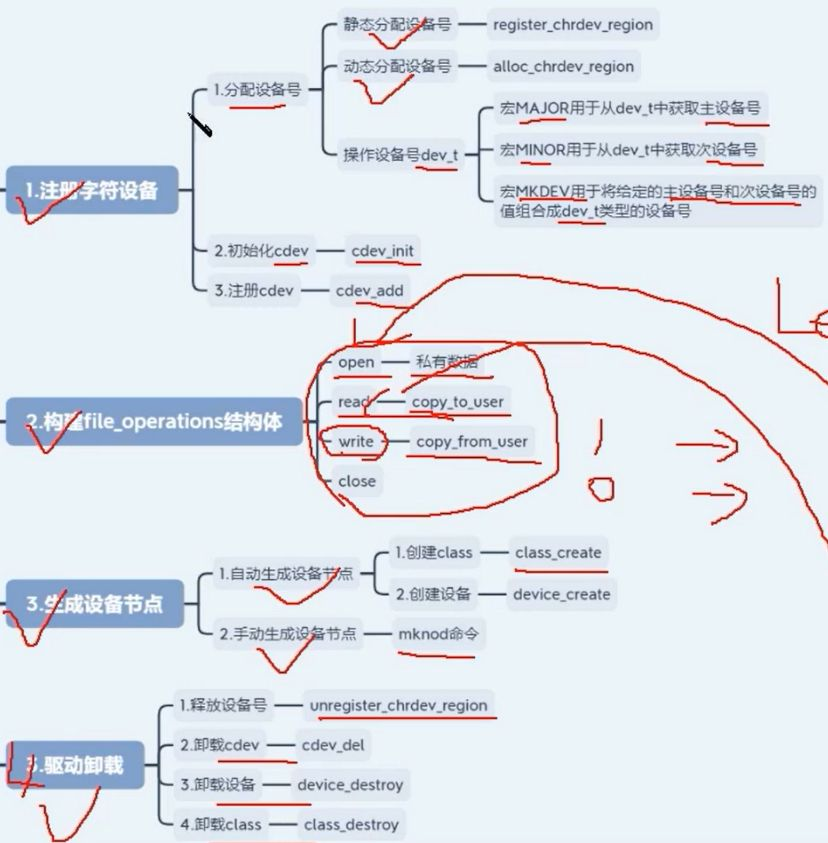
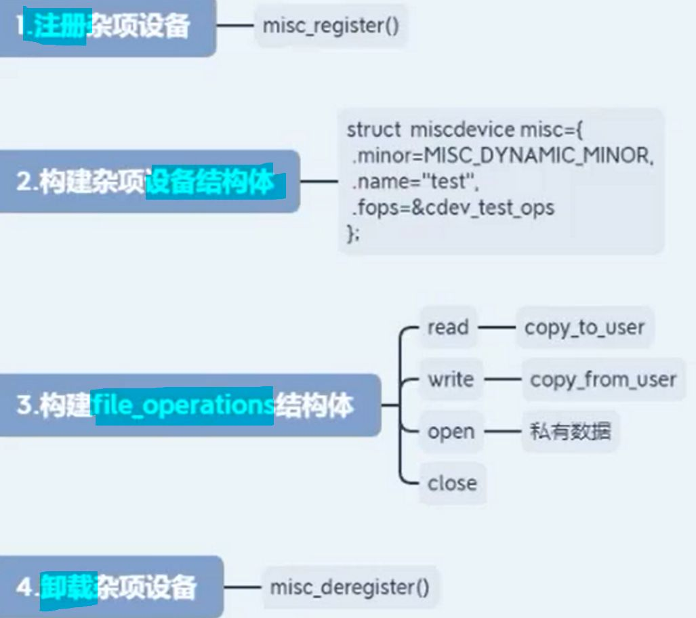
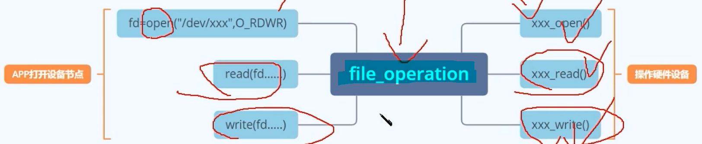
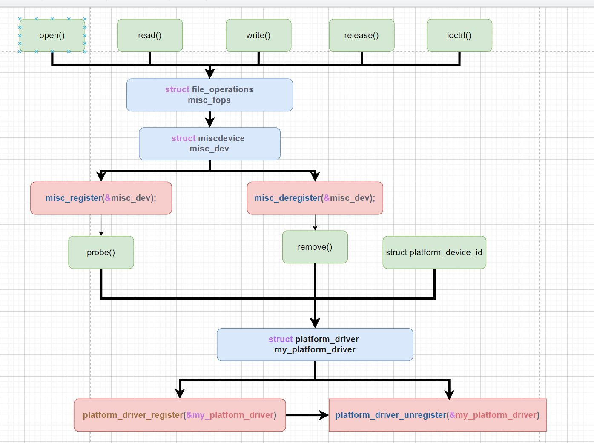
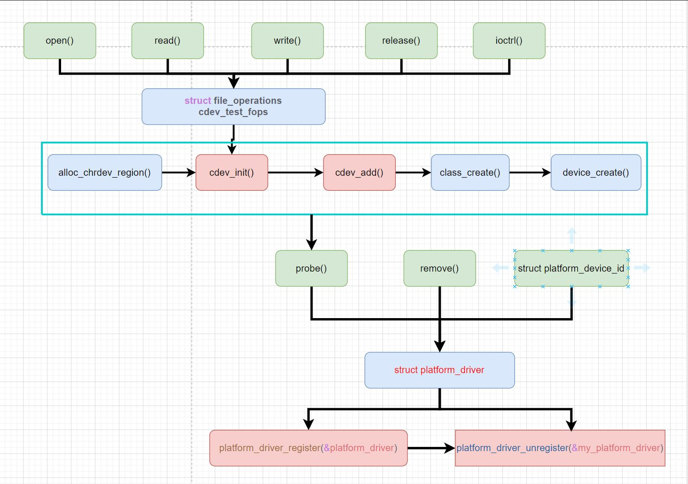

# 字符设备驱动框架
[[嵌入式知识学习（通用扩展）/linux驱动入门/第二期 字符设备基础/assets/大纲：/6ddb958a9633838ef9584a58385c6c51_MD5.jpeg|Open: file-20250910230608761.png]]

# 杂项设备驱动框架
[[嵌入式知识学习（通用扩展）/linux驱动入门/第二期 字符设备基础/assets/大纲：/3f9018d147bbb09a27398295d5c7f5ef_MD5.jpeg|Open: file-20250910230727411.png]]

# file_operation操作集
[[嵌入式知识学习（通用扩展）/linux驱动入门/第二期 字符设备基础/assets/大纲：/8daaee9fbf7019f4d09f98abdeb83bcc_MD5.jpeg|Open: file-20250910230752649.png]]

# 杂项设备驱动的思维导图
[[嵌入式知识学习（通用扩展）/linux驱动入门/第二期 字符设备基础/assets/大纲：/7828380026604dd271d8f277498cc011_MD5.jpeg|Open: file-20250910231200351.png]]

# 字符设备驱动的思维导图

[[嵌入式知识学习（通用扩展）/linux驱动入门/第二期 字符设备基础/assets/大纲：/6e03bec3315882de9c16ea845048b64e_MD5.jpeg|Open: file-20250910231210423.png]]

