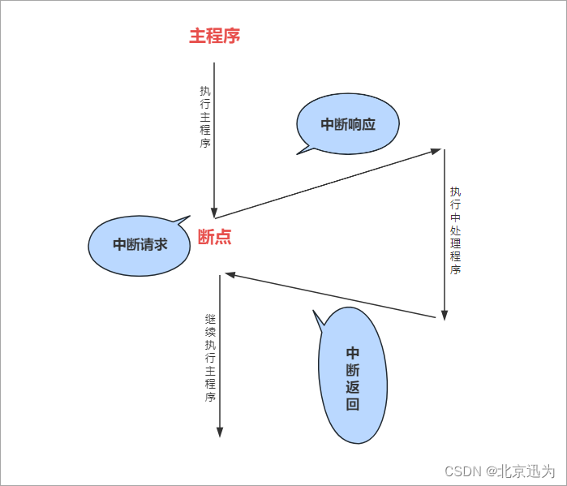
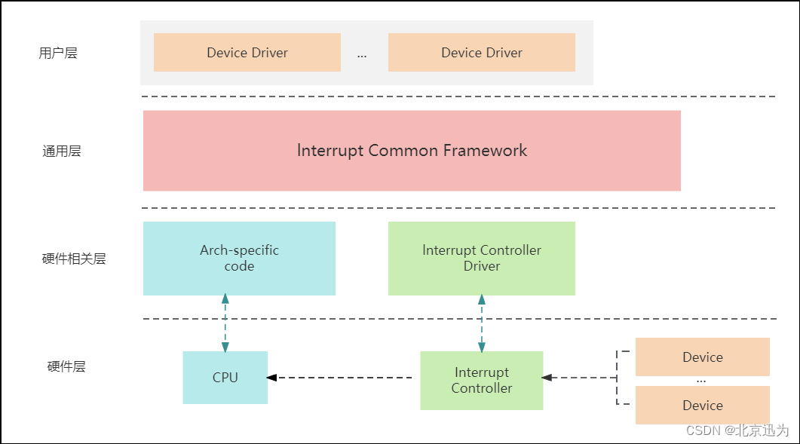
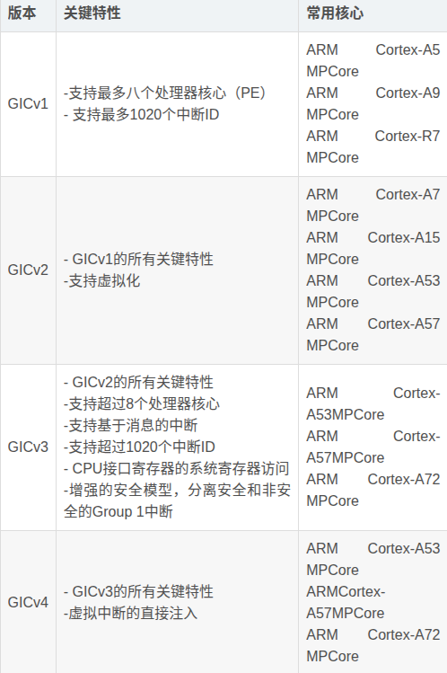
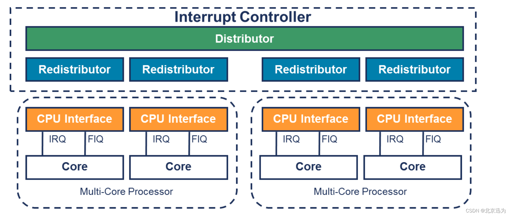
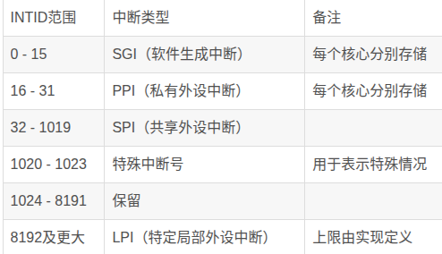
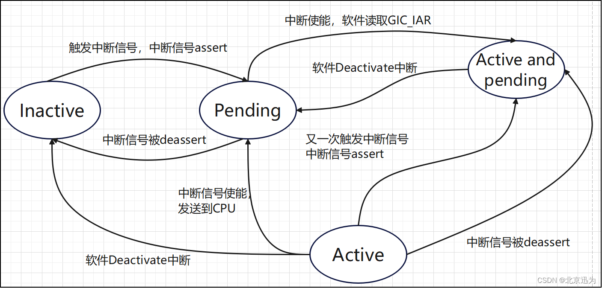
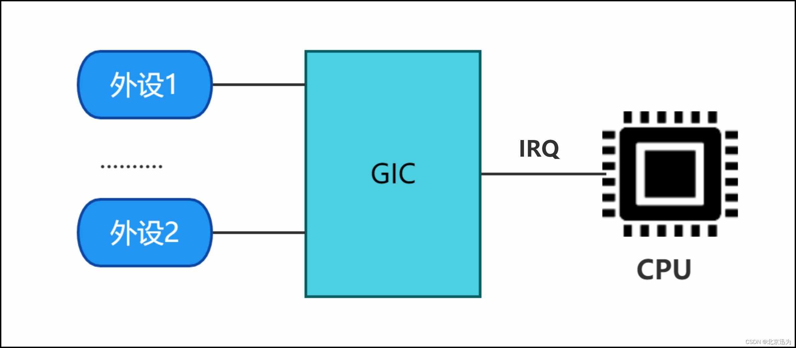
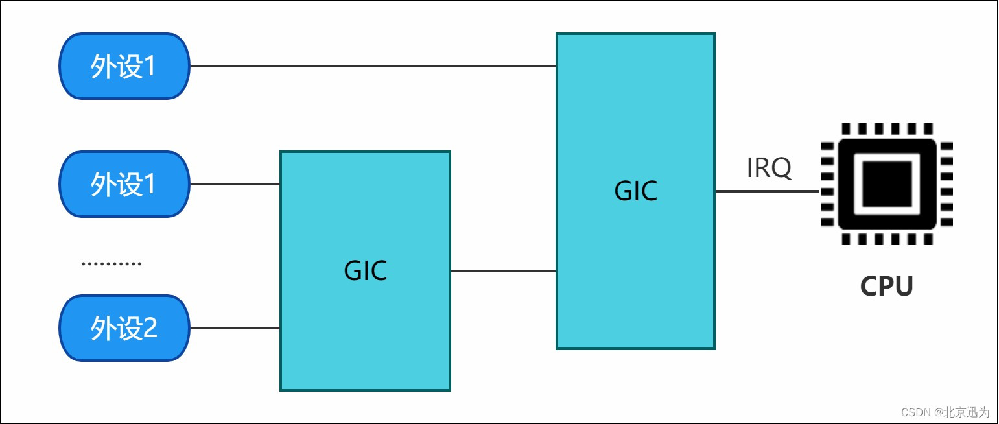
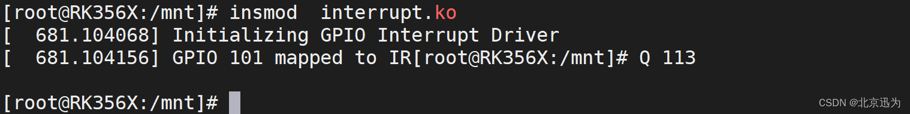
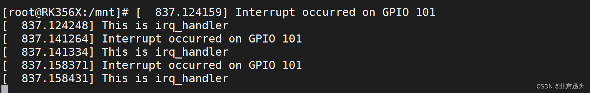

# 备注(声明)：


# 参考文章：

[RK3568驱动指南｜第五篇－中断－第39章中断实验\_瑞芯微 中断控制器-CSDN博客](https://blog.csdn.net/BeiJingXunWei/article/details/132919262)


# 一、什么是中断？

## 中断的概念
### 1 、一种机制
> 当中断发生时，CPU会停止当前正在执行的程序，并转而执行触发该中断的中断处理程序。处理完中断处理程序后，CPU会返回到中断发生的地方，继续执行被中断的程序。中断机制允许CPU在实时响应外部或内部事件的同时，保持对其他任务的处理能力。

### 2 、中断图解


### 3 、


## 中断的重要性

### 4 、处理意外情况的能力


### 5、提高了系统的资源利用率和并发处理能力


### 6、

## 中断的上下半部
### 7、中断上文
> 中断上文是中断服务程序的第一部分，它主要处理一些**紧急且需要快速响应的任务**。中断上文的特点是执行**时间较短**，旨在尽快完成对中断的处理。这些任务可能包括**保存寄存器状态、更新计数器等**，以便在中断处理完成后能够正确地返回到中断前的执行位置

### 8、中断下文
> 中断下文是中断服务程序的第二部分，它主要处理一些**相对耗时的任务**。由于中断上文需要尽快完成，因此中断下文负责处理那些不能立即完成的、需要更多时间的任务。这些任务可能**包括复杂的计算、访问外部设备或进行长时间的数据处理**等。


# 二、中断子系统框架
## 中断子系统框架
### 1 、用户层：（💌）
> 用户层是**中断的使用者**，主要包括**各类设备驱动**。这些驱动程序通过中断相关的接口进行中断的申请和注册。当外设触发中断时，用户层驱动程序会进行相应的回调处理，执行特定的操作。


### 2 、通用层：
> 通用层也可称为框架层，它是硬件无关的层次。通用层的代码**在所有硬件平台上都是通用的**，不依赖于具体的硬件架构或中断控制器。通用层**提供了统一的接口和功能**，用于管理和处理中断，使得驱动程序能够在不同的硬件平台上复用。


### 3 、硬件相关层：
> 硬件相关层包含两部分代码。**一部分是与特定处理器架构相关的代码**，比如ARM64处理器的中断处理相关代码。这些代码负责处理特定架构的中断机制，包括中断向量表、中断处理程序等。**另一部分是中断控制器的驱动代码**，用于与中断控制器进行通信和配置。这些代码与具体的中断控制器硬件相关。


### 4 、硬件层：
> 硬件层位于最底层，与**具体的硬件连接**相关。它包括外设与SoC（系统片上芯片）的物理连接部分。中断信号从外设传递到中断控制器，由中断控制器统一管理和路由到处理器。硬件层的设计和实现决定了中断信号的传递方式和硬件的中断处理能力。


### 5、框架图（💌）


### 6、


## 中断控制器GIC
### 1 、硬件层中的一个关键组件：管理和控制中断
> 用于**管理和控制中断**。它接收来自各种中断源的中断请求，并根据预先配置的中断优先级、屏蔽和路由规则，将中断请求分发给适当的处理器核心或中断服务例程。


### 2 、GIC版本
> GIC是由ARM公司提出设计规范，当前有四个版本，GIC V1-v4。设计规范中最常用的，有3个版本V2.0、V3.1、V4.1，GICv3版本设计主要运行在Armv8-A, Armv9-A等架构上。ARM公司并给出一个实际的控制器设计参考，比如GIC-400(支持GIC v2架构)、gic500(支持GIC v3架构)、GIC-600(支持GIC v3和GIC v4架构)。最终芯片厂商可以自己实现GIC或者直接购买ARM提供的设计。

- 1 RK3568上使用的GIC版本为GICv3


#### GICv3中断控制器模型如下：



### 3 、Distributor中断仲裁器：
- 1 包含影响所有处理器核心中断的全局设置。包含以下编程接口：
> ●启用和禁用SPI。
> 
> ●设置每个SPI的优先级级别。
> 
> ●每个SPI的路由信息。
> 
> ●将每个SPI设置为电平触发或边沿触发。
> 
> ●生成基于消息的SPI。
> 
> ●控制SPI的活动和挂起状态。
> 
> ●用于确定在每个安全状态中使用的程序员模型的控制（亲和性路由或遗留模型）。


### 4 、Redistributor重新分配器：
- 1 对于每个连接的处理器核心（PE），都有一个重新分配器（Redistributor）。重新分配器提供以下编程接口：

> ●启用和禁用SGI（软件生成的中断）和PPI（处理器专用中断）。
> 
> ●设置SGI和PPI的优先级级别。
> 
> ●将每个PPI设置为电平触发或边沿触发。
> 
> ●将每个SGI和PPI分配给一个中断组。
> 
> ●控制SGI和PPI的状态。
> 
> ●对支持关联LPI（低功耗中断）的中断属性和挂起状态的内存中的数据结构进行基址控制。
> 
> ●支持与连接的处理器核心的电源管理。


### 5、CPU接口：
- 1 每个重新分配器都连接到一个CPU接口。CPU接口提供以下编程接口：

> ●通用控制和配置，用于启用中断处理。
> 
> ●确认中断。
> 
> ●执行中断的优先级降低和停用。
> 
> ●为处理器核心设置中断优先级屏蔽。
> 
> ●定义处理器核心的抢占策略。
> 
> ●确定处理器核心最高优先级的挂起中断。

### 6、


### 7、


### 8、


## 中断类型

### 1 、每个中断类型的介绍如下
- 1 GIC-V3支持四种类型的中断，分别是SGI、PPI、SPI和LPI

> SGI（Software Generated Interrupt，**软件生成中断**）：SGI 是通过向 GIC 中的 SGI 寄存器写入来生成的中断。它通常用于处理器之间的通信，允许一个 PE 发送中断给一个或多个指定的 PE，中断号ID0 - ID15用于SGI。
> 
> PPI（Private Peripheral Interrupt，**私有外设**中断）：针对特定 PE 的外设中断。不与其他 PE 共享，中断号ID16 - ID31用于PPI。
> 
> SPI（Shared Peripheral Interrupt，**共享外设**中断）：全局外设中断，可以路由到指定的处理器核心（PE）或一组 PE，它允许多个 PE 接收同一个中断。中断号ID32 - ID1019用于SPI，
> 
> LPI（Locality-specific Peripheral Interrupt，**特定局部外设**中断）：LPI 是 GICv3 中引入的一种中断类型，与其他类型的中断有几个不同之处。LPI 总是基于消息的中断，其配置存储在内存表中，而不是寄存器中。


### 2 、INTID范围



### 3 、中断处理的状态机


> Inactive（非活动状态）：中断源当前未被触发。
> 
> Pending（等待状态）：中断源已被触发，但尚未被处理器核心确认。
> 
> Active（活动状态）：**中断源已被触发，并且已被处理器核心确认。**
> 
> Active and Pending（活动且等待状态）：已确认一个中断实例，同时另一个中断实例正在等待处理。


### 4 、每个外设中断可以是以下两种类型之一（💌）
- 1 边沿触发（Edge-triggered）：
> 这是一种在检测到中断信号**上升沿时触发的中断**，然后无论信号状态如何，都保持触发状态，直到满足本规范定义的条件来清除中断。

- 1 电平触发（Level-sensitive）：
> 这是一种在中断信号**电平处于活动状态时触发**的中断，并且在电平不处于活动状态时取消触


### 5、
## 中断号

### 6、IRQ number：（💌）
> CPU需要为每一个外设中断编号，我们称之IRQ Number。这个IRQ number是一个**虚拟的interrupt ID，和硬件无关，仅仅是被CPU用来标识一个外设中断**。

### 7、HW interrupt ID：
> 对于GIC中断控制器而言，它收集了多个外设的interrupt request line并向上传递，因此，GIC中断控制器需要对外设中断进行编码。**GIC中断控制器用HW interrupt ID来标识外设的中断**。


#### 一个GIC中断控制器
> **如果只有一个GIC中断控制器，那IRQ number和HW interrupt ID是可以一一对应的**，如下图（图 39-7）所示：



#### GIC中断控制器级联
> **仅仅用HW interrupt ID就不能唯一标识一个外设中断**，还需要知道该HW interrupt ID所属的GIC中断控制器（HW interrupt ID在不同的Interrupt controller上是会重复编码的）。



> 因此，linux kernel中的中断子系统需要**提供一个将HW interrupt ID映射到IRQ number上来的机制，也就是irq domain**。


### 8、


## 中断申请函数
### 1 、request_irq()（💌）
```d
函数原型：

    int request_irq(unsigned int irq, irq_handler_t handler, unsigned long flags, const char *name, void *dev);

头文件：

    #include <linux/interrupt.h>

函数作用：

request_irq 函数的主要功能是请求一个中断号，并将一个中断处理程序与该中断号关联起来。当中断事件发生时，与该中断号关联的中断处理程序会被调用执行。

参数含义：

irq：要请求的中断号（IRQ number）。

handler：指向中断处理程序的函数指针。

flags：标志位，用于指定中断处理程序的行为和属性，如中断触发方式、中断共享等。

name：中断的名称，用于标识该中断。

dev：指向设备或数据结构的指针，可以在中断处理程序中使用。

返回值：

成功：0 或正数，表示中断请求成功。

失败：负数，表示中断请求失败，返回的负数值表示错误代码。
```

#### 常用的标志位
- 1 unsigned long flags：中断处理程序的标志位
```c
IRQF_TRIGGER_NONE：无触发方式，表示中断不会被触发。
IRQF_TRIGGER_RISING：上升沿触发方式，表示中断在信号上升沿时触发。
IRQF_TRIGGER_FALLING：下降沿触发方式，表示中断在信号下降沿时触发。
IRQF_TRIGGER_HIGH：高电平触发方式，表示中断在信号为高电平时触发。
IRQF_TRIGGER_LOW：低电平触发方式，表示中断在信号为低电平时触发。
IRQF_SHARED：中断共享方式，表示中断可以被多个设备共享使用。
```

> **指定中断处理程序的行为和属性**，如中断触发方式、中断共享等。可以使用不同的标志位进行**位运算来组合多个属性**。


### 2 、gpio_to_irq()（💌）
- 1 将 GPIO 引脚的编号（GPIO pin number）转换为对应的中断请求号
```c
函数原型：

unsigned int gpio_to_irq(unsigned int gpio);

头文件：

#include <linux/gpio.h>

函数功能：
gpio_to_irq 是一个用于将 GPIO 引脚映射到对应中断号的函数。它的作用是根据给定的 GPIO 引脚号，获取与之关联的中断号。

参数说明：

gpio：要映射的 GPIO 引脚号。

返回值：

成功：返回值为该 GPIO 引脚所对应的中断号。

失败：返回值为负数，表示映射失败或无效的 GPIO 引脚号。

```


### 3 、free_irq()
- 1 释放之前通过 request_irq 函数注册的中断处理程序。它的作用是取消对中断的注册并释放相关的系统资源。

```c
函数原型：

void free_irq(unsigned int irq, void *dev_id);

头文件：

#include <linux/interrupt.h>

函数功能：

free_irq 函数用于释放之前通过 request_irq 函数注册的中断处理程序。它会取消对中断的注册并释放相关的系统资源，包括中断号、中断处理程序和设备标识等。

参数说明：

irq：要释放的中断号。

dev_id：设备标识，用于区分不同的中断请求。它通常是在 request_irq 函数中传递的设备特定数据指针。

返回值：

free_irq 函数没有返回值。

```


### 4 、

## 中断服务函数

### 5、中断事件发生时自动调用的函数
- 1 它负责处理与中断相关的操作，例如读取数据、清除中断标志、更新状态等。

### 6、`irqreturn_t handler(int irq, void *dev_id) `（💌）

```c
函数原型：

irqreturn_t handler(int irq, void *dev_id);

函数功能：

handler 函数是一个中断服务函数，用于处理特定中断事件。它在中断事件发生时被操作系统或硬件调用，执行必要的操作来响应和处理中断请求。

参数说明：

irq：表示中断号或中断源的标识符。它指示引发中断的硬件设备或中断控制器。

dev_id：是一个 void 类型的指针，用于传递设备特定的数据或标识符。它通常用于在中断处理程序中区分不同的设备或资源。

返回值：

irqreturn_t 是一个特定类型的枚举值，用于表示中断服务函数的返回状态。它可以有以下几种取值：

	IRQ_NONE：表示中断服务函数未处理该中断，中断控制器可以继续处理其他中断请求。
	
	IRQ_HANDLED：表示中断服务函数已成功处理该中断，中断控制器无需进一步处理。
	
	IRQ_WAKE_THREAD：表示中断服务函数已处理该中断，并且请求唤醒一个内核线程来继续执行进一步的处理。这在一些需要长时间处理的中断情况下使用。

```


### 7、注意以下几个方面：
> （1）处理程序应该尽可能地**快速执行**，以避免中断丢失或过多占用 CPU 时间。
> 
> （2）如果中断源是共享的，处理程序**需要处理多个设备共享同一个中断的情况**。
> 
> （3）处理程序可能需要与其他部分的代码进行同步，例如访问共享数据结构或使用同步机制来保护临界区域。
> 
> （4）处理程序可能需要与其他线程或进程进行通信，例如唤醒等待的线程或发送信号给其他进程。


### 8、


# 三、实验
> 网盘路径为：iTOP-RK3568开发板【底板V1.7版本】\03_【iTOP-RK3568开发板】指南教程\02_Linux驱动配套资料\04_Linux驱动例程\30_interrupt\03_中断驱动例程。

## 实验程序编写
### 1 、实验目标
> 将实现**注册显示屏触摸中断**，每按当触摸LCD显示屏就会触发中断服务函数，在中断服务函数中会打印申请的GPIO号和This is irq_handler。

### 2 、GPIO pin脚计算（💌）
- 1 iTOP-RK3568有 5 组 GPIO bank：GPIO0~GPIO4，每组又以 A0~A7, B0~B7, C0~C7, D0~D7 作为编号区分
```c
GPIO pin脚计算公式：pin = bank * 32 + number     //bank为组号，number为小组编号
GPIO 小组编号计算公式：number = group * 8 + X  
```

#### 举例：
- 1 LCD触摸屏对应的中断引脚标号为TP_INT_L_GPIO3_A5
```c
bank = 3;       //GPIO3_A5=> 3, bank ∈ [0,4]
group = 0;      //GPIO3_A5 => 0, group ∈ {(A=0), (B=1), (C=2), (D=3)}
X = 5;         //GPIO3_A5 => 5, X ∈ [0,7]
number = group * 8 + X = 0 * 8 + 5 =5
pin = bank*32 + number= 3 * 32 + 5 = 101;

4*32+8+1
128+9  137
```

- 2 所以GPIO_PIN是101


### 3 、编写完成的interrupt.c如下所示
```c
#include <linux/module.h>
#include <linux/init.h>
#include <linux/gpio.h>
#include <linux/interrupt.h>
 
#define GPIO_PIN 101
 
// 中断处理函数
static irqreturn_t gpio_irq_handler(int irq, void *dev_id)
{
    printk(KERN_INFO "Interrupt occurred on GPIO %d\n", GPIO_PIN);
    printk(KERN_INFO "This is irq_handler\n");
    return IRQ_HANDLED;
}
 
static int __init interrupt_init(void)
{
    int irq_num;
 
    printk(KERN_INFO "Initializing GPIO Interrupt Driver\n");
 
    // 将GPIO引脚映射到中断号
    irq_num = gpio_to_irq(GPIO_PIN);
    printk(KERN_INFO "GPIO %d mapped to IRQ %d\n", GPIO_PIN, irq_num);
 
    // 请求中断
    if (request_irq(irq_num, gpio_irq_handler, IRQF_TRIGGER_RISING, "irq_test", NULL) != 0){
        printk(KERN_ERR "Failed to request IRQ %d\n", irq_num);
 
        // 请求中断失败，释放GPIO引脚
        gpio_free(GPIO_PIN);
        return -ENODEV;
    }
    return 0;
}
 
static void __exit interrupt_exit(void)
{                                                                                                                                                                                                                                     
    int irq_num = gpio_to_irq(GPIO_PIN);
    // 释放中断
    free_irq(irq_num, NULL);
    printk(KERN_INFO "GPIO Interrupt Driver exited successfully\n");
}
 
module_init(interrupt_init);
module_exit(interrupt_exit);
MODULE_LICENSE("GPL");
MODULE_AUTHOR("topeet");
```

#### 关键代码如下（💌）
```c
#define GPIO_PIN 101
 
// 中断处理函数
static irqreturn_t gpio_irq_handler(int irq, void *dev_id)
{
    return IRQ_HANDLED;
}


static int __init interrupt_init(void)：
    // 将GPIO引脚映射到中断号
    irq_num = gpio_to_irq(GPIO_PIN);
	
    // 请求中断
    if (request_irq(irq_num, gpio_irq_handler, IRQF_TRIGGER_RISING, "irq_test", NULL) != 0){


static void __exit interrupt_exit(void):
    // 释放中断
    free_irq(irq_num, NULL);	

```


### 4 、


## 运行测试
### 1 、insmod interrupt.ko


### 2 、然后触摸LCD屏，触发中断服务程序


### 3 、


## 
### 1 、


### 2 、


### 3 、


### 4 、


### 5、


### 6、


### 7、


### 8、


# 四、

## 
### 1 、


### 2 、


### 3 、


### 4 、


### 5、


### 6、


### 7、


### 8、


## 
### 1 、


### 2 、


### 3 、


### 4 、


### 5、


### 6、


### 7、


### 8、


## 
### 1 、


### 2 、


### 3 、


### 4 、


### 5、


### 6、


### 7、


### 8、


# 五、

## 
### 1 、


### 2 、


### 3 、


### 4 、


### 5、


### 6、


### 7、


### 8、


## 
### 1 、


### 2 、


### 3 、


### 4 、


### 5、


### 6、


### 7、


### 8、


## 
### 1 、


### 2 、


### 3 、


### 4 、


### 5、


### 6、


### 7、


### 8、


