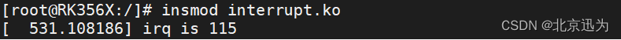
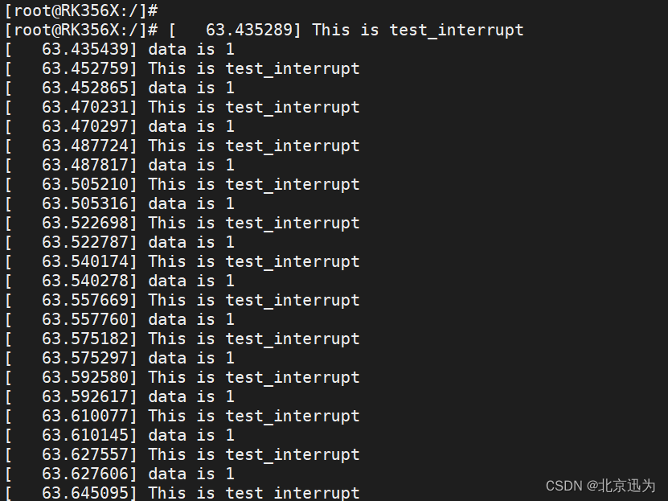
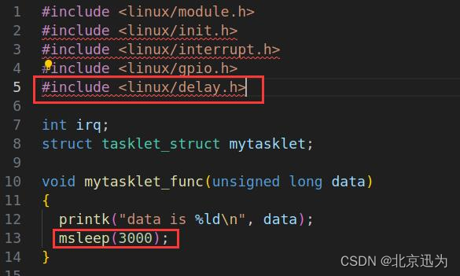
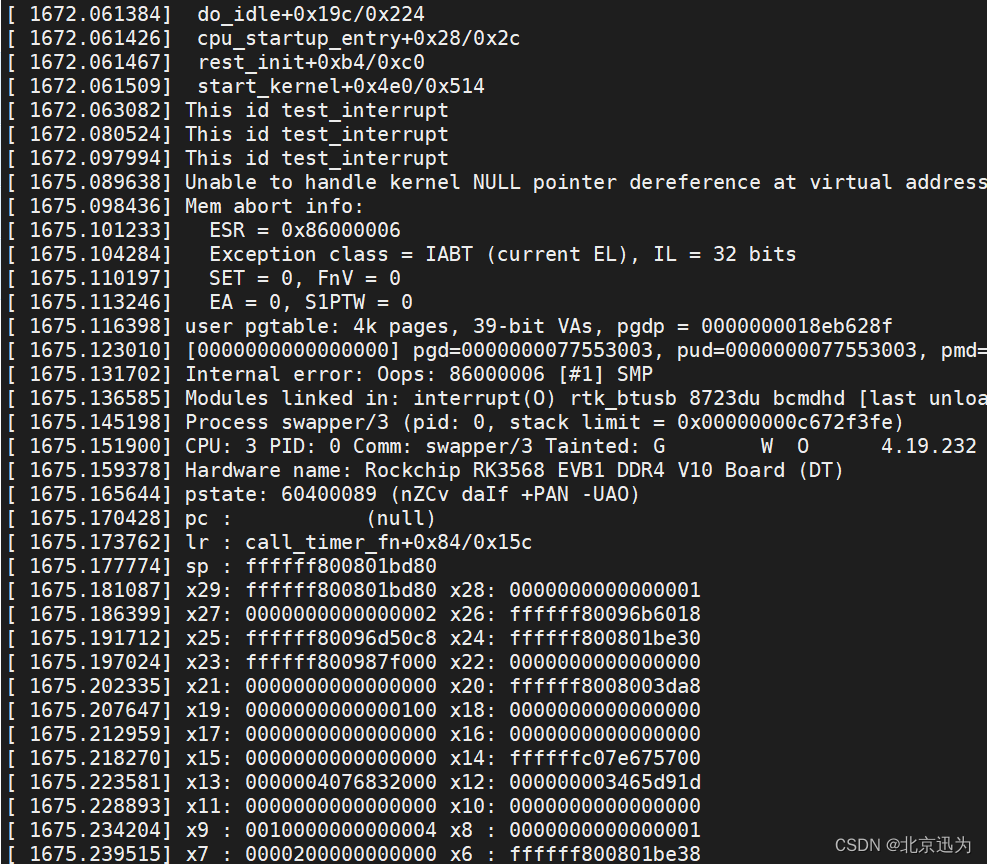

# 备注(声明)：


# 参考文章：


# 一、tasklet了解

## 什么是tasklet
### 1 、特殊的软中断机制


### 2 、在多核处理系统上可以避免并发问题。
- 1 Tasklet绑定的函数在同一时间只能在一个CPU上运行，因此不会出现并发冲突


- 2 tasklet绑定的函数中不能调用可能导致休眠的函数，否则可能引起内核异常。


### 3 、结构体的定义：tasklet_t（💌）
- 1 定义位于include/linux/interrupt.h头文件中

```c
struct tasklet_struct {
	//指向下一个tasklet的指针，用于形成链表结构，以便内核中可以同时管理多个tasklet。
    struct tasklet_struct *next;
    unsigned long state;
	//用于引用计数，用于确保tasklet在多个地方调度或取消调度时的正确处理。
    atomic_t count;
	//指向tasklet绑定的函数的指针，该函数将在tasklet执行时被调用。
    void (*func)(unsigned long);
	//传递给tasklet绑定函数的参数
    unsigned long data;
};
typedef struct tasklet_struct tasklet_t;
```


### 4 、


# 二、 tasklet相关接口函数

## 静态初始化宏函数
### 1 、DECLARE_TASKLET


### 2 、宏函数的原型如下：
```c
#define DECLARE_TASKLET(name,func,data) \
struct tasklet_struct name = { NULL,0,ATOMIC_INIT(0),func,data} 
```
> name是tasklet的名称，func是tasklet的处理函数，data是传递给处理函数的参数。

- 2 初始化状态为使能状态。


#### 非使能状态的宏函数
```c
#define DECLARE_TASKLET_DISABLED(name,func,data) \
struct tasklet_struct name = { NULL,0,ATOMIC_INIT(1),func,data} 
```
- 2 初始化状态为非使能状态。


### 3 、使用示例
```c
#include <linux/interrupt.h>
 
// 定义tasklet处理函数
void my_tasklet_handler(unsigned long data)
{
    // Tasklet处理逻辑
    // ...
}
 
// 静态初始化tasklet
DECLARE_TASKLET(my_tasklet, my_tasklet_handler, 0);
// 驱动程序的其他代码
```

> 在上述示例中，my_tasklet是tasklet的名称，my_tasklet_handler是tasklet的处理函数，0是传递给处理函数的参数。但是需要注意的是，使用DECLARE_TASKLET**静态初始化的tasklet无法在运行时动态销毁，因此在不需要tasklet时，应该避免使用此方法**.  如果需要在运行时销毁tasklet，应使用tasklet_init和tasklet_kill函数进行动态初始化和销毁，接下来我们来学习动态初始化函数。

### 4 、


## 动态初始化函数
### 5、tasklet_init函数（💌）


### 6、函数原型: 
```c
void tasklet_init(struct tasklet_struct *t, void (*func)(unsigned long), unsigned long data);
```

### 7、动态初始化示例: 
```c
#include <linux/interrupt.h>
 
// 定义tasklet处理函数
void my_tasklet_handler(unsigned long data)
{
    // Tasklet处理逻辑
    // ...
}
 
// 声明tasklet结构体
static struct tasklet_struct my_tasklet;
 
// 初始化tasklet
tasklet_init(&my_tasklet, my_tasklet_handler, 0);
// 驱动程序的其他代码
```

> 可以根据需要**灵活地管理和控制tasklet的生命周期**。在不再需要tasklet时，可以使**用tasklet_kill函数进行销毁**，以释放相关资源。

### 8、


## 关闭函数
### 1 、tasklet_disabled函数（💌）


### 2 、函数的原型如下：
```c
void tasklet_disable(struct tasklet_struct *t);
```

### 3 、关闭tasklet示例
```c
#include <linux/interrupt.h>
 
// 定义tasklet处理函数
void my_tasklet_handler(unsigned long data)
{
    // Tasklet处理逻辑
    // ...
}
// 声明tasklet结构体
static struct tasklet_struct my_tasklet;
// 初始化tasklet
tasklet_init(&my_tasklet, my_tasklet_handler, 0);
// 关闭tasklet
tasklet_disable(&my_tasklet);
// 驱动程序的其他代码
```


### 4 、注意：
> **关闭tasklet后，即使调用tasklet_schedule函数**触发tasklet，**tasklet的处理函数也不会再被执行**。这可以用于临时暂停或停止tasklet的执行，直到再次启用（通过调用tasklet_enable函数）。

> 关闭tasklet并不会销毁tasklet结构体，因此**可以随时通过调用tasklet_enable函数重新启用tasklet**，或者调用tasklet_kill函数来销毁tasklet。

### 5、


## 使能函数（💌）

### 6、tasklet_enable函数
- 1 （启用）一个已经初始化的tasklet

### 7、函数的原型如下
```c
void tasklet_enable(struct tasklet_struct *t);
```


### 8、使能tasklet示例：
```c
#include <linux/interrupt.h>
// 定义tasklet处理函数
void my_tasklet_handler(unsigned long data)
{
    // Tasklet处理逻辑
    // ...
}
 
// 声明tasklet结构体
static struct tasklet_struct my_tasklet;
 
// 初始化tasklet
tasklet_init(&my_tasklet, my_tasklet_handler, 0);
 
// 使能tasklet
tasklet_enable(&my_tasklet);
// 驱动程序的其他代码
```


### 9、注意
> **使能tasklet后，如果调用tasklet_schedule函数触发tasklet，则tasklet的处理函数将会被执行**。这样，tasklet将开始按计划执行其处理逻辑。

> 需要注意的是，**使能tasklet并不会自动触发tasklet的执行**，而是通过调用tasklet_schedule函数来触发。同时，可以**使用tasklet_disable函数来临时暂停或停止tasklet的执行**。如果需要永久停止tasklet的执行并释放相关资源，则应调用tasklet_kill函数来销毁tasklet。


## 调度函数
### 1 、tasklet_schedule函数


### 2 、调度（触发）一个已经初始化的tasklet执行（💌）


### 3 、函数的原型如下：
```c
void tasklet_schedule(struct tasklet_struct *t);
```


### 4 、调度tasklet执行示例：

```c
#include <linux/interrupt.h>
// 定义tasklet处理函数
void my_tasklet_handler(unsigned long data)
{	
    // Tasklet处理逻辑
    // ...
}
 
// 声明tasklet结构体
static struct tasklet_struct my_tasklet;
 
// 初始化tasklet
tasklet_init(&my_tasklet, my_tasklet_handler, 0);
// 调度tasklet执行
tasklet_schedule(&my_tasklet);
// 驱动程序的其他代码
```

### 5、注意：（💌）
> 调度tasklet**只是将tasklet标记为需要执行，并不会立即执行**tasklet的处理函数。**实际的执行时间取决于内核的调度和处理机制。**


### 6、


### 7、


## 销毁函数
### 1 、tasklet_kill函数


### 2 、销毁一个已经初始化的tasklet，释放相关资源（💌）


### 3 、函数的原型如下：
```c
void tasklet_kill(struct tasklet_struct *t);
```


### 4 、销毁tasklet示例：
```c
#include <linux/interrupt.h>
 
// 定义tasklet处理函数
void my_tasklet_handler(unsigned long data)
{	
    // Tasklet处理逻辑
    // ...
}
 
// 声明tasklet结构体
static struct tasklet_struct my_tasklet;
 
// 初始化tasklet
tasklet_init(&my_tasklet, my_tasklet_handler, 0);
tasklet_disable(&my_tasklet);
 
// 销毁tasklet
tasklet_kill(&my_tasklet);
 
// 驱动程序的其他代码
```


### 5、注意
> 调用tasklet_kill函数会释放tasklet所占用的资源，并将tasklet标记为无效。

> 在**销毁tasklet之前，应该确保该tasklet已经被停止**（通过调用tasklet_disable函数）。否则，销毁一个正在执行的tasklet可能导致内核崩溃或其他错误。

> 一旦销毁了tasklet，如果**需要再次使用tasklet，需要重新进行初始化**（通过调用tasklet_init函数）


### 6、


# 三、实验
> 网盘路径为：iTOP-RK3568开发板【底板V1.7版本】\03_【iTOP-RK3568开发板】指南教程\02_Linux驱动配套资料\04_Linux驱动例程\32_tasklet\module。


## 驱动程序编写
### 1 、实验目标：
> 本实验将实现注册**显示屏触摸中断**，每按当触摸LCD显示屏就会触发中断服务函数，在中断服务函数中**调度中断下文tasklet处理函数**，打印“This id test_interrupt”和“data is 1”。

### 2 、编写完成的interrupt.c代码
```c
#include <linux/module.h>
#include <linux/init.h>
#include <linux/interrupt.h>
#include <linux/gpio.h>
// #include <linux/delay.h>
 
int irq;
struct tasklet_struct mytasklet;
 
// 定义tasklet处理函数
void mytasklet_func(unsigned long data)
{
  printk("data is %ld\n", data);
  // msleep(3000);
}
 
// 中断处理函数
irqreturn_t test_interrupt(int irq, void *args)
{
  printk("This id test_interrupt\n");
  tasklet_schedule(&mytasklet); // 调度tasklet执行
  return IRQ_RETVAL(IRQ_HANDLED);
}
// 模块初始化函数
static int interrupt_irq_init(void)
{
  int ret;
  irq = gpio_to_irq(101); // 将GPIO转换为中断号
  printk("irq is %d\n", irq);
 
  // 请求中断
  ret = request_irq(irq, test_interrupt, IRQF_TRIGGER_RISING, "test", NULL);
  if (ret < 0)
  {
    printk("request_irq is error\n");
    return -1;
  }
  // 初始化tasklet
  tasklet_init(&mytasklet, mytasklet_func, 1);
  return 0;
}
// 模块退出函数
static void interrupt_irq_exit(void)
{
 
  free_irq(irq, NULL);
  tasklet_kill(&mytasklet);   // 销毁tasklet
  printk("bye bye\n");
}
 
module_init(interrupt_irq_init); // 指定模块的初始化函数
module_exit(interrupt_irq_exit); // 指定模块的退出函数
 
MODULE_LICENSE("GPL");   // 模块使用的许可证
MODULE_AUTHOR("topeet"); // 模块的作者
```

#### 关键代码：（💌）
```c
struct tasklet_struct mytasklet;

// 定义tasklet处理函数
void mytasklet_func(unsigned long data)
{
}

// 中断处理函数
irqreturn_t test_interrupt(int irq, void *args)
{
  tasklet_schedule(&mytasklet); // 调度tasklet执行
  return IRQ_RETVAL(IRQ_HANDLED);
}


static int interrupt_irq_init(void)：
  // 初始化tasklet
  tasklet_init(&mytasklet, mytasklet_func, 1);


static void interrupt_irq_exit(void)：

  tasklet_kill(&mytasklet);   // 销毁tasklet

```


 2. 1 tasklet_kill(&mytasklet)
> 如果 tasklet 已被调度但还没执行 → 取消调度；
> 如果 tasklet 正在其他 CPU 上运行 → 阻塞当前 CPU，直到它执行完毕；
> 销毁 tasklet，**只用 tasklet_kill()就可** —— 它是“终结者”，不是“开关”。


#### IRQ_RETVAL(x) ：自动转成标准返回值
- 1 更通用


### 3 、


### 4 、


## 运行测试
### 1 、驱动模块的加载


### 2 、用手触摸连接的LVDS 7寸屏幕，触发中断服务程序


### 3 、


### 4 、


## 驱动文件中添加休眠函数实验
### 1 、tasklet函数中不能调用休眠的函数


### 2 、修改代码



### 3 、用手触摸连接的LVDS 7寸屏幕，打印如下：内核会崩溃。（💌）



### 4 、


### 5、


# 四、

## 
### 1 、


### 2 、


### 3 、


### 4 、


### 5、


### 6、


### 7、


### 8、


## 
### 1 、


### 2 、


### 3 、


### 4 、


### 5、


### 6、


### 7、


### 8、


# 五、

## 
### 1 、


### 2 、


### 3 、


### 4 、


### 5、


### 6、


### 7、


### 8、


## 
### 1 、


### 2 、


### 3 、


### 4 、


### 5、


### 6、


### 7、


### 8、


## 
### 1 、


### 2 、


### 3 、


### 4 、


### 5、


### 6、


### 7、


### 8、


